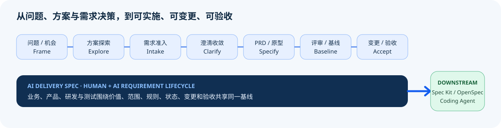

# AI Delivery Spec 5.4.6 — Requirement Management for Human & AI｜人机共用需求管理

> 只有一句想法，大模型就急着写 PRD，方向和价值还没想清楚？
>
> PRD 看起来很完整，产品、前端、后端和测试却各自理解了一套规则？
>
> 需求一变，页面、字段、状态、接口、测试和验收漏改，最后只能反复开会补口径？

**Any Stage In. Right-Sized Artifact Out. One Traceable Requirement Baseline.**

**AI Delivery Spec 不是“把材料改写成 PRD”的生成器。**它是面向大模型时代、适用于 ToC 与 ToB/ToG 的需求管理 Skill：从业务问题、用户痛点或一个 Idea 开始，也能从会议纪要、竞品、旧 PRD、原型、存量系统、变更或缺陷进入；帮助人和 AI 一起完成问题定义、方案探索、需求准入、澄清收敛、规格与原型、评审基线、变更影响、追溯和验收。

它的目标不是多写文档，而是让业务能确认、产品能决策、研发不必猜、测试可以验、负责人知道哪些已证明、哪些仍需人来决定。

[]()
[](LICENSE)
[](https://github.com/franklinxkk/ai-delivery-spec)

<!-- CLAIM: CLM-ADOPTION-20260808; as_of=2026-08-08; evidence=public-platform-pages-verified -->
公开采用信号（截至 2026-08-08）：[ClawHub 1.6k+ 下载，安全审计 Pass](https://clawhub.ai/franklinxkk/skills/ai-delivery-spec) · [SkillHub AI 评分 4.8/5.0，双安全报告无风险](https://skillhub.cn/skills/user_12c92261/ai-delivery-spec)。如果它帮你减少了返工，欢迎到 [GitHub 点个 Star ⭐](https://github.com/franklinxkk/ai-delivery-spec)。

## 先看它能帮你的角色

| 角色 | 工作中最容易失控的地方 | AI Delivery Spec 提供的帮助 |
|---|---|---|
| 初级产品经理 | 不知道该问什么，容易把页面描述当完整需求 | 用问题、范围、规则、异常和验收清单逐步带教；先交最小需求卡，不用模板制造“专业感” |
| 中高级产品经理 | 跨角色、跨模块、状态和数据链路复杂，遗漏往往到开发后才暴露 | 把旅程、页面、字段、规则、状态、指标、异常和权限收敛成同一基线，并做正反向追溯 |
| 产品负责人 / 产品总监 | 团队输出质量依赖个人水平，内审难、标准落不下去 | 建立可复用的需求质量底线、分级交付、评审视角、变更与验收证据；保留负责人最终判断 |
| 业务、售前、实施、设计 | 客户语言、业务目标和界面方案之间容易失真 | 从问题与场景出发比较方案，标出事实、假设和未知项；按阶段交付可确认材料或产品态原型 |
| 前端开发 | 入口、可见性、交互状态、字段限制和失败反馈经常不完整 | 获得页面与动作合同、权限差异、状态结果、异常恢复和可观察验收，不靠猜测补交互 |
| 后端开发 | 权威数据源、计算口径、状态守卫、幂等边界和责任方常在评审后才补 | 获得业务对象、规则、数据流、状态约束、事件与错误语义；技术方案仍由研发负责 |
| 测试工程师 | 只有正向 AC，没有反例、边界、证据和回归范围 | 从需求反推正向、反向、异常、权限与状态用例，记录执行证据、缺陷和有条件验收 |
| 技术主管 / 架构师 | 业务边界不稳就被迫先定架构，变更影响难评估 | 看清系统边界、消费者、权威源、跨模块状态和 NFR 约束；把产品未知与技术决策分开 |

同一个 Skill 不要求所有角色跑完整流程。初级产品经理可以用它获得引导，中高级产品经理用它管理复杂度，产品总监用它守质量底线，研发和测试则从同一需求事实中读取各自需要的精确切片。

## 你现在在哪，就从哪里开始

不必先学阶段名、模板或 L0—L4。它覆盖的不只是“已有材料 → PRD”：

| 你从哪里开始 | Skill 做什么 | 典型输出 |
|---|---|---|
| 从零开始：只有问题、机会或模糊 Idea | 识别用户与痛点时刻、证据、成功信号；发散方案、推荐聚焦并设计最小验证 | 问题简报、方案草图、假设与验证计划 |
| 需要决定做不做 | 核对价值、范围、责任、依赖、复杂度和风险，不用长文档掩盖决策空洞 | 需求准入结论、优先级依据、停止条件 |
| 需求还说不清 | 批量澄清会改变范围的事实和决策，区分已知、假设、未知与冲突 | 澄清简报、决策记录、规则与异常 |
| 要做成产品 | 纵向闭环用户目标、旅程、页面/数据、规则/状态、指标、异常和验收 | 一份统一 PRD；按需配工程原型与机器附录 |
| 已有 PRD、原型或系统 | 先盘点现状与来源优先级，再找遗漏、冲突和不可实施处；不擅自推翻已确认内容 | Stage 0 清单、差异报告、修订产物、评审记录 |
| 需求发生变化 | 比较新旧基线，分析受影响的角色、页面、规则、数据、测试和消费者 | 变更包、影响分析、同步与回归范围 |
| 准备测试或客户验收 | 把 AC 变成执行记录，区分静态通过、真实实现、领域确认和客户签署 | 验收记录、证据、缺陷、遗留条件与结论 |



**核心承诺：只做到当前目标，不强迫补跑无关流程。**只有用户明确要求端到端闭环时，才持续推进到目标完成。

## 60 秒上手

```bash
# Codex / Claude Code / Cursor / Trae 等 Agent Skills 兼容工具
npx skills add franklinxkk/ai-delivery-spec

# OpenClaw
openclaw skills install @franklinxkk/ai-delivery-spec
```

安装后直接使用自然语言，不需要先填写参数：

```text
使用 $ai-delivery-spec。我是<角色>，现在有<想法、问题、材料或系统>，
本次只要<目标产物或停止点>。先复用已确认事实；只问会改变范围或结果的问题；
未经确认不要猜。交付最小但完整的结果，自检并说明仍未证明的部分。
```

可以这样开始：

- 初级产品经理：“客户只说想提高续费率。先帮我定义问题、列出需要验证的机会，不要直接写功能清单。”
- 中高级产品经理：“这是跨三个模块的需求。先梳理角色主链、状态与数据流，再输出统一 PRD 和验收。”
- 产品总监：“评审这份需求是否达到产品部开工底线，按产品、研发、测试三个视角给出阻断项和辅导建议。”
- 前端开发：“只复述页面入口、权限、状态、交互结果和异常；不清楚的地方列 GAP，不要替产品发明规则。”
- 后端开发 / 架构师：“从需求中提取对象、权威源、计算口径、状态守卫、事件、NFR 与待定技术决策。”
- 测试工程师：“把需求转换成正反用例、边界、异常、权限、证据和回归清单，并标出不可验收的描述。”

你不需要说 `Ultra-Light`、`L2` 或任何阶段名。只要说真实目标：

- “把列表里的‘联系人’改成‘企业联系人’，其他逻辑不变。”——自动按快速小改处理：直接改，只说明差异、边界、正反验收和未证明事项，不建整套文档。
- “新增审批状态，会影响三个角色、消息、统计和历史数据。”——自动升级为标准需求，只补状态、权限、数据、异常与回归合同。
- “跨两个系统双向同步，涉及监管口径和正式验收。”——进入治理交付，才启用权威源、数据流、追溯、门禁和验收证据。

一个 Idea 也能开始，不需要先补齐材料。最小可运行样例见 [examples/minimal-v5](examples/minimal-v5/README.md)。

<!-- COMPAT: smart-large-project remains a supported governed-delivery profile; newcomers do not need to name it. -->

**English works end to end.** Use $ai-delivery-spec and say: “Enter at my current stage, follow my language, ask only scope-changing questions, deliver the smallest complete artifact, mark what remains unproven, and stop at my target.” Diagnostics support `--language auto|en-US|zh-CN`; stable IDs and machine keys remain unchanged.

## 一套需求生命周期，不是一条僵硬流水线

`frame → explore → intake → clarify → specify → review → baseline → change / acceptance`

先定义问题和可证伪方案，再做准入与澄清；形成规格后由各角色评审并锁定基线；后续变更回到旧基线分析影响，验收记录真实证据与结论。阶段只是路由地图：目标明确就直达目标，方向模糊时先“发散 → 推荐聚焦 → 深化关键链”，再询问真正会改变方案的决策。

## 一份基线，让每个角色看到自己需要的精度

普通项目默认是一份统一 PRD：正文让客户、业务、产品和传统开发顺序读懂；同文档工程附录让前后端、测试与 Coding Agent 精确执行。只有持续变更、多投影或强审计场景才启用分片真相（Product Truth）。

| 共同需求事实 | 产品关心 | 研发关心 | 测试关心 |
|---|---|---|---|
| 目标与范围 | 用户价值、成功指标、不做什么 | 系统边界、依赖和兼容范围 | 可验收结果、排除项 |
| 角色与权限 | 旅程、入口和职责 | 页面、API、数据与动作权限 | 越权、空数据和脱敏场景 |
| 规则与状态 | 业务条件、状态含义和异常处理 | 状态守卫、事件、幂等与失败语义 | 正向、反向、边界和恢复 |
| 字段与指标 | 展示、填写、口径与解释 | 类型、来源、计算、持久化和版本 | 输入组合、精度、缺失与证据 |
| 变更与验收 | 决策、影响、客户确认 | 消费方同步和回归范围 | 用例执行、缺陷回链和结论 |

稳定 ID 把来源、需求、页面、动作、字段、规则、AC、测试和证据连接起来。语义不完整时，研发或 Agent 必须报告 GAP，而不是凭经验补一个“看起来合理”的实现。

## 产品态、评审态与 Coding Agent 不是一回事

- 客户演示、方案探索和首次需求确认默认交付可操作的产品态。
- 只有用户明确要求“评审版、编号标注、评审抽屉”等可见投影时，才生成评审态。
- “交开发、给前后端测试看、开评审会”只说明消费方；若评审态偏好未确认，先询问一次。
- 评审态只保留页面共识、编号标注、核心流程和角色必需说明，不把整份 PRD 塞进原型。
- Coding Agent 使用同一基线里的稳定 ID、规则、状态、验收和结构化 handoff，不把右侧说明当机器合同。

跨页面、模块或角色主链需要流程图；存在受守卫状态变化时需要状态转换图；跨系统、双向同步或多权威源时需要数据流/血缘图。简单单页 CRUD 不机械堆图。

## 给产品团队建立质量底线，而不是统一写作口吻

产品负责人或产品总监可以把它作为团队的需求内审与赋能层：

1. **个人辅导**：根据产品经理当前能力补齐问题定义、澄清、规则、异常和验收，不替代其业务判断。
2. **分级交付**：小改动只交需求卡，常规需求交一份统一 PRD，高风险或持续变更项目才启用更强治理。
3. **角色内审**：让业务、产品、设计、前端、后端、测试和架构按各自镜头复述，暴露“大家都说懂了”的假共识。
4. **公司扩展**：团队术语、模板、领域规则和声明式门禁进入私有 `custom/`，不把客户资料写进公共 Skill。
5. **质量度量**：记录缺口、返工、变更遗漏和验收证据；不能用文档长度、静态 PASS 或 AI 评分替代真实交付效果。

它可以守住结构、追溯和显性规则的底线，但不能替产品总监做人员评价，不能替领域负责人确认事实，也不能替客户签收。

## 与 Spec Kit / OpenSpec 怎么配合

[Spec Kit](https://github.com/github/spec-kit) 与 [OpenSpec](https://github.com/Fission-AI/OpenSpec) 都在持续扩展探索、澄清和团队能力，因此不能简单说它们“只接已确定需求”。它们的核心仍更贴近代码仓库中的 spec-driven development：规格、技术计划、任务与实现协作。

AI Delivery Spec 的主场是更广的 **requirement-to-acceptance**：可以在没有代码仓库时从业务问题开始，处理客户/制度/竞品/现状等多来源，明确价值、范围、决策权、业务规则、评审基线、变更和验收，再把已基线切片交给下游。

| 主要目标 | 推荐起点 |
|---|---|
| 还在判断问题、机会、价值、范围和责任 | **AI Delivery Spec** |
| 要统一业务、产品、研发、测试和客户的需求事实 | **AI Delivery Spec** |
| 已进入代码仓库，要形成技术计划、任务并实现 | **Spec Kit / OpenSpec / Coding Agent** |
| 既要需求治理，又要实现闭环 | **AI Delivery Spec 定准基线 → 下游工具规划与编码 → 实现/测试证据回流验收** |

它们有交集，不是互斥替代。选择哪个工具，取决于你当前最需要控制的是业务需求不确定性，还是代码实现过程。

## 门禁：诚实发现缺口，不制造绿灯

只使用 Agent 完成需求工作时无需 Python。要运行零模型本地门禁，再安装 Python 3.10+、PyYAML 与 jsonschema **两个本地依赖**：

```bash
python -m pip install -r scripts/requirements.txt
python scripts/ai_delivery_spec_cli.py route-stage --target clarify --artifact problem-brief.md --format json
python scripts/ai_delivery_spec_cli.py gate --profile prd --prd requirements/PRD.md --level L2 --language auto

# 分发 Word 前：先去机器 frontmatter，再转换/渲染，最后检查泄漏
python scripts/ai_delivery_spec_cli.py project-human --input requirements/PRD.md --output requirements/PRD.human.md
python scripts/ai_delivery_spec_cli.py check-distribution --document requirements/PRD.docx
```

持久化产物使用 `ADS:*` 语义锚点和 `resume_context` 续跑；门禁区分 `BLOCK / P0_UNKNOWN / GAP / PASS`，并明确 `not_proven`。静态 PASS 不证明视觉、浏览器交互、真实实现、法规适用性或客户验收。

常见恢复：`python scripts/ai_delivery_spec_cli.py explain-finding PRD-STRUCTURE`；大项目中断后运行 `python scripts/ai_delivery_spec_cli.py resume`，不要从头重写。完整说明见[排障与恢复](references/troubleshooting.md)。

## 复杂项目才启用 Product Truth

普通需求不需要巨型 YAML。只有规模、审计或多投影门槛触发时，按以下顺序使用分片真相：

```bash
python scripts/ai_delivery_spec_cli.py init-requirements --output requirements --with-product-truth
python scripts/ai_delivery_spec_cli.py compile-truth --index requirements/truth/index.yaml
python scripts/ai_delivery_spec_cli.py trace --truth requirements/truth/compiled/product-truth.yaml --output requirements/traceability.yaml --baseline-version 1.0
python scripts/ai_delivery_spec_cli.py impact --truth requirements/truth/compiled/product-truth.yaml --change requirements/changes/CHG-CORE-001.yaml
```

项目自己的术语、模板差异和声明式门禁放在私有 `custom/`，不要修改公共 Skill：

```bash
python scripts/ai_delivery_spec_cli.py init-custom --output custom --sharing local
python scripts/ai_delivery_spec_cli.py init-requirements --output requirements --custom-root custom --template my-team
python scripts/ai_delivery_spec_cli.py gate --profile prd --prd requirements/PRD.md --custom-root custom --domain my-team
```

同一 `custom/` 注册多个领域时，每条领域规则使用 `domain` 或 `domains` 限定适用范围，并为门禁重复传入当前工件的 `--domain`。未限定的规则视为团队全局规则；存在领域限定规则却没有提供领域上下文时，门禁会阻断而不是跨领域误伤或静默跳过。

内置领域包：`traffic`、`crm`、`education-it`、`data-product`、`ai-native`、`oa`、`medical-hospital-it`。当前均为 `contract_tested`；其中部分基于维护者真实实践标记为 `production_practiced`，其余为 `knowledge_only`。这些状态只描述来源与验证边界，不等于当前项目的领域正确性、生产可用性或专家签署。

## 明确边界

AI Delivery Spec 管理的是**需求事实与验收闭环**，不接管研发排期、Sprint、技术架构决策、代码生成、CI/CD、部署、监控和线上运营。它可以记录下游系统返回的证据，但不能替代产品负责人、架构师、领域专家、测试或客户签署。

Markdown + YAML frontmatter 是可校验权威基线；DOCX/PDF 是基线后的分发副本。模型常识和内置知识包都不能替代项目法规、客户决定或责任人确认。

## 仓库与验证

`SKILL.md` 保存始终加载的触发与路由；`references/` 按阶段提供合同和领域资料；`schemas/` 与 `scripts/` 提供机器契约和确定性门禁；`maintainer/` 仅用于发版验证，不进入普通项目上下文。

```bash
python scripts/ai_delivery_spec_cli.py check
python scripts/ai_delivery_spec_cli.py check --profile release --keep-going
```

发布包路径与校验器接线由维护者手动执行：分别运行 `python scripts/validators/validate_release_package.py` 和 `python scripts/validators/validate_validator_wiring.py`；它们不并入普通项目 gate。完整证据边界见[维护者说明](maintainer/README.md)，版本变化见 [CHANGELOG](CHANGELOG.md)。

## 支持项目

如果 AI Delivery Spec 让产品、研发和测试少开一次“补规则”的会，欢迎 [给项目点个 Star ⭐](https://github.com/franklinxkk/ai-delivery-spec)。有 Bug 或建议请[提交 Issue](https://github.com/franklinxkk/ai-delivery-spec/issues)，贡献说明见 [.github/CONTRIBUTING.md](.github/CONTRIBUTING.md)。
