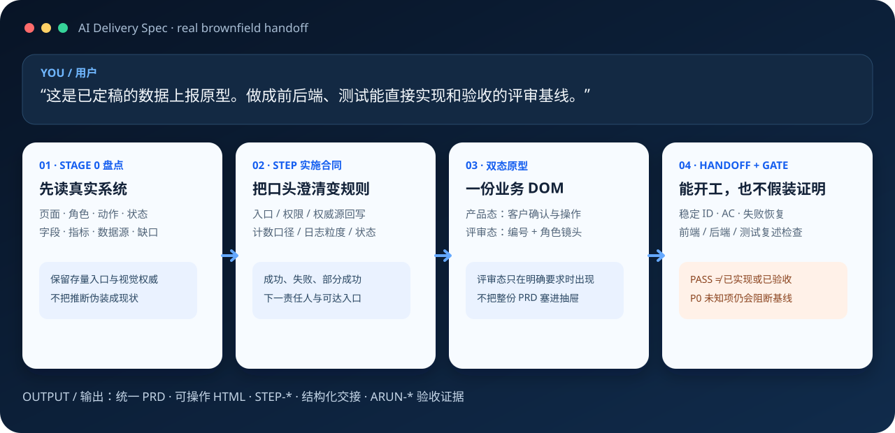

# AI Delivery Spec 5.4.4 — Requirements to Delivery｜需求到交付

**把一句话、客户材料或存量系统，收敛成业务可确认、开发可实施、Coding Agent 不必猜、测试可验收的同一份需求基线。**

[]()
[](LICENSE)
[](https://github.com/franklinxkk/ai-delivery-spec)

<!-- CLAIM: CLM-ADOPTION-20260808; as_of=2026-08-08; evidence=public-platform-pages-verified -->
公开采用信号（截至 2026-08-08）：[ClawHub 1.6k+ 下载，安全审计 Pass](https://clawhub.ai/franklinxkk/skills/ai-delivery-spec) · [SkillHub AI 评分 4.8/5.0，双安全报告无风险](https://skillhub.cn/skills/user_12c92261/ai-delivery-spec)。如果它帮你减少了返工，欢迎到 [GitHub 点个 Star ⭐](https://github.com/franklinxkk/ai-delivery-spec)。



```text
你：这是已经定稿的数据上报原型。做成前后端、测试能直接实现和验收的评审基线。

AI Delivery Spec：
1. 先盘点现有入口、角色、动作、状态、字段、指标和数据源，不擅自重做业务；
2. 把计数口径、日志粒度、权威源回写、提交边界和下一入口写入 STEP-*；
3. 共用一份业务 DOM：产品态用于操作/确认，明确要求后才叠加编号评审态；
4. 输出统一 PRD、可操作 HTML、结构化 handoff 和可执行验收；
5. 门禁只证明结构与追溯，P0 未知项仍阻断基线，PASS 不冒充“已实现/已验收”。
```

## 与 Spec Kit / OpenSpec 的一句话边界

它们从已确定需求走向代码；AI Delivery Spec 从业务问题、客户材料或存量系统走到可验收需求基线，再把已基线切片交给下游实现。

## 60 秒上手

```bash
# Codex / Claude Code / Cursor / Trae 等 Agent Skills 兼容工具
npx skills add franklinxkk/ai-delivery-spec

# OpenClaw
openclaw skills install @franklinxkk/ai-delivery-spec
```

安装后直接说自然语言，不必先学阶段或模板：

```text
Use $ai-delivery-spec / 使用 ai-delivery-spec。
我是<角色>，已有<材料、原型或系统>，本次要<目标产物或停止点>。
复用已确认事实，只询问会改变范围或结果的问题；未经确认不得猜。
完成最小但完整的目标产物、自检并说明仍未证明的部分。
```

按角色举例：

- 产品经理：“只有客户一句话需求，先澄清并给一页需求卡；不要扩成大型 PRD。”
- 产品经理：“在旧 HTML 上加二级维护预警列，先做差异盘点，保留现有布局和交互。”
- 售前：“给客户演示 CRM，只要干净产品态；不要评审标注。”
- 研发评审：“我要评审版：编号 + 右侧抽屉，按共识/前端/后端/测试切换。”
- 产品主管：“已有 PRD 和原型，只检查前后端、测试能否无猜测实现与验收。”

一个可逆 ToC 小改可说 “Ultra-Light”；常规 ToB/ToG 需求使用 Standard L2；大型或高风险项目可说 “Full L3 smart-large-project”。只有一个 Idea 也能开始，不需要先补齐整套文档。最小可运行样例见 [examples/minimal-v5](examples/minimal-v5/README.md)。

**English works end to end.** Use $ai-delivery-spec and say: “Follow the user's language, reuse confirmed facts, ask only scope-changing questions, deliver the smallest complete artifact, run the applicable gate, and stop at my target.” Diagnostics support `--language auto|en-US|zh-CN`; stable IDs, API names, field keys and machine enums remain unchanged.

## 你会得到什么

**Any Stage In. Right-Sized Artifact Out. One Traceable Requirement Baseline.**

| 当前处境 | 最小完整输出 |
|---|---|
| 一句话、访谈、客户痛点 | 问题简报：用户、痛点时刻、证据、成功信号、未知项 |
| 方案或竞品还在比较 | 方案草图：可选方案、不做选项、取舍、最小验证 |
| 要决定做不做、何时做 | 需求准入：价值、优先级、复杂度、依赖、结论 |
| 规则还不清楚 | 澄清简报：范围、决策、规则、异常、责任人 |
| 要交开发/Coding Agent | 一份统一 PRD；按需配工程原型与结构化 handoff |
| 已有 PRD/原型要评审 | 缺口清单、评审记录、角色复述、可执行验收 |
| 需求变化 | `CHG-*` 变更包、影响分析、同步与回归范围 |
| 准备验收 | `ARUN-*` 执行证据、缺陷、条件和签署结论 |

普通项目默认是一份统一 PRD：正文让客户、产品和开发顺序读懂，同文档工程附录让测试与 AI Coding 精确执行。只有持续变更、多投影或强审计场景才启用分片真相（Product Truth）。

## 为什么不是直接用 Spec Kit / OpenSpec？

它们是优秀的 **spec-to-code** 工具；AI Delivery Spec 解决的是更早、也更长的 **requirement-to-acceptance** 问题。不是替代关系，最稳妥的组合是：先把需求基线定准，再把已基线切片交给下游实现。

| 你的主要问题 | 更适合的起点 |
|---|---|
| 已决定做什么，要形成技术方案、任务并编码 | Spec Kit / OpenSpec / Coding Agent |
| 还要判断值不值得做、范围与责任是否成立 | **AI Delivery Spec** |
| 客户材料、旧 PRD、截图和存量系统互相冲突 | **AI Delivery Spec** 的 Stage 0、来源优先级与未知项 |
| PRD、原型、字段、状态、测试和验收要保持同一事实 | **AI Delivery Spec** 的稳定 ID、变更与追溯 |
| 同时需要需求治理和代码实现 | **AI Delivery Spec → Spec Kit/OpenSpec/Coding Agent** |


> 选择原则：目标从代码仓库里的规划和实现开始，优先使用 Spec Kit/OpenSpec；目标从业务问题、客户确认或产品部质量底线开始，先使用 AI Delivery Spec。

## 产品态与评审态

- 客户演示、需求确认和一句话首次进入原型，默认先交付可操作的产品态。
- 只有用户明确要求“评审版/评审模式/编号标注/评审抽屉”才生成可见评审态。
- “交开发、给前后端测试看、开评审会”只说明消费方；尚未确认时继续产品态并询问一次。
- 产品态与评审态共用同一业务 DOM、状态和 `ACT-*`。评审态只投影页面共识、核心 `STEP-*` 和角色必需差异，不复制整份 PRD。
- 无页面入口权限的角色，菜单和路由入口不可见；不要虚构一个“进入后提示无权限”的页面。

评审态必须让开发和测试直接看懂：入口与权限、输入与权威源、处理/计算口径、状态守卫、可见与持久结果、事件/日志与责任交接、失败恢复、追溯与验收。真实项目尤其要写清计数单位、日志一行代表什么、差异确认回写哪个源、选中与未选数据的提交边界，以及生成对象后从哪里继续处理。

## 门禁：诚实证明，不制造绿灯

只用 Agent 完成需求工作时无需 Python。要运行零模型本地门禁，再安装 Python 3.10+、PyYAML 与 jsonschema **两个本地依赖**：

```bash
python -m pip install -r scripts/requirements.txt
python scripts/ai_delivery_spec_cli.py route-stage --target clarify --artifact problem-brief.md --format json
python scripts/ai_delivery_spec_cli.py gate --profile prd --prd requirements/PRD.md --level L2 --language auto
```

持久化产物使用 `ADS:*` 语义锚点和 `resume_context` 续跑；门禁区分 `BLOCK / P0_UNKNOWN / GAP / PASS`，并明确 `not_proven`。静态 PASS 不证明视觉、浏览器交互、实现、法规适用性或客户验收。

常见恢复：`python scripts/ai_delivery_spec_cli.py explain-finding PRD-STRUCTURE`；大项目中断后运行 `python scripts/ai_delivery_spec_cli.py resume`，不要从头重写。完整说明见[排障与恢复](references/troubleshooting.md)。

## 复杂项目才启用 Product Truth

普通需求不需要巨型 YAML。只有规模、审计或多投影门槛触发时，按以下顺序使用：

```bash
python scripts/ai_delivery_spec_cli.py init-requirements --output requirements --with-product-truth
python scripts/ai_delivery_spec_cli.py compile-truth --index requirements/truth/index.yaml
python scripts/ai_delivery_spec_cli.py trace --truth requirements/truth/compiled/product-truth.yaml --output requirements/traceability.yaml --baseline-version 1.0
python scripts/ai_delivery_spec_cli.py impact --truth requirements/truth/compiled/product-truth.yaml --change requirements/changes/CHG-CORE-001.yaml
```

项目自己的术语、模板差异和声明式门禁放在私有 `custom/`，不要修改官方 Skill：

```bash
python scripts/ai_delivery_spec_cli.py init-custom --output custom --sharing local
python scripts/ai_delivery_spec_cli.py init-requirements --output requirements --custom-root custom --template my-team
```

领域知识按需查询，例如 `python scripts/ai_delivery_spec_cli.py query-domain --domain traffic --format yaml`。模型常识和知识包都不能替代项目法规、客户决定或领域责任人确认。

内置领域包：`traffic`、`crm`、`education-it`、`data-product`、`ai-native`、`oa`、`medical-hospital-it`。当前包成熟度为 `contract_tested`；真实实践状态区分 `production_practiced` 与 `knowledge_only`。这些标签只说明来源与契约回归边界，不等于项目规则、专家结论或生产正确性。

## 5.4.4 解决了什么

- 中英文完整生命周期跟随用户语言；中文正文不再裸露 Given/When/Then、draft、lastCursor 等机器标签。
- 一句话需求可澄清到可操作原型；评审态只在明确要求时出现，同一需求基线不重复追问。
- 评审抽屉从“把 PRD 搬上页面”改为克制的 `STEP-*` 实施合同与角色镜头。
- 权限分为菜单/路由入口、数据范围、动作/组件和字段四层。
- 跨模块主链、状态转换、数据流/血缘按复杂度提供核心图。
- 存量系统保留视觉与交互权威；新增动作、处理器、可见结果和浏览器证据可回归。
- 门禁输出双语根因、修复动作和仍未证明项；运行包披露来源提交与 dirty 状态。

## 明确边界

AI Delivery Spec 管理的是**需求事实与验收闭环**，不接管研发排期、Sprint、技术架构决策、编码、CI/CD、部署和线上运营。它可以记录这些系统返回的证据引用，但不能替代产品负责人、架构师、领域专家、测试或客户签署。

Markdown + YAML frontmatter 是可校验权威基线；DOCX/PDF 是基线后的分发副本。旧 DOCX 先回到人可复核的 Markdown 草案，补来源、稳定 ID 和开放项后再过门禁，不提供会伪造结构正确性的“一键迁移”。

## 仓库与验证

```text
SKILL.md     始终加载的精简触发与路由规则
references/  按阶段读取的合同、模板、领域与排障资料
schemas/     需求、变更、交接和验收的机器契约
scripts/     公共 CLI、分析与确定性门禁
examples/    最小可运行示例
maintainer/  仅发版时使用的测试、评测和证据实验室
```

```bash
python scripts/ai_delivery_spec_cli.py check
python scripts/ai_delivery_spec_cli.py check --profile release --keep-going
```

发布包路径与校验器接线由维护者手动执行：分别运行 `python scripts/validators/validate_release_package.py` 和 `python scripts/validators/validate_validator_wiring.py`；它们不并入普通项目 gate。维护实验室受文件数、体积和默认快速命令预算约束，不进入第三方运行包。完整证据边界见[维护者说明](maintainer/README.md)，版本变化见 [CHANGELOG](CHANGELOG.md)。

## 支持项目

如果 AI Delivery Spec 让产品、开发和测试少开一次“补规则”的会，欢迎 [给项目点个 Star ⭐](https://github.com/franklinxkk/ai-delivery-spec)。有 Bug 或建议请[提交 Issue](https://github.com/franklinxkk/ai-delivery-spec/issues)，贡献说明见 [.github/CONTRIBUTING.md](.github/CONTRIBUTING.md)。
