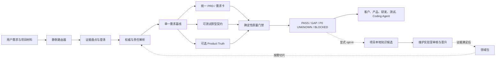

# AI Delivery Spec v5.3.0 整合版详细设计

> 文档状态：设计基线候选（待实现）  
> 基于版本：v5.2.0 / `b778ceb`  
> 设计日期：2026-07-18  
> 设计范围：合并原计划 v5.2.1—v5.4 中已经具备实施条件的事项  
> 公开版本建议：一次发布 `v5.3.0`，不连续发布 v5.2.1、v5.3、v5.4  
> 不在本次范围：Product Truth 默认升主、正式生成可执行测试、项目管理与研发执行

## 1. 结论与关键决策

本次不是给 v5.2.0 再叠一层流程，而是做一次“运行时收敛、门禁归一、证据化学习”的整合改造。

最终只保留三个不可替代的核心价值：

1. 提供模型无法从通用能力中可靠推断的项目事实、领域边界和责任权限；
2. 把这些事实组织成一份人类可读、传统研发可施工、Coding Agent 不必猜的需求基线；
3. 用零 LLM 的确定性门禁拦住缺失、漂移和伪完整，而不是让生成者自行宣布合格。

本设计冻结以下决策：

| 决策 | 结论 | 原因 |
|---|---|---|
| 发布版本 | 统一发布 v5.3.0 | 修复与新能力同时出现，符合 minor；避免版本号继续快速膨胀 |
| 默认需求基线 | 统一 PRD | 当前真实项目和团队协作已证明，人类可读基线仍是主路径 |
| Product Truth | 继续按规模、变更和审计条件选用 | 尚无证据支持默认升主；不得提前实现 v6.0 叙事 |
| 用户是否必须选模式 | 否，默认静默分诊 | 模式是内部执行参数，不应成为新手认知负担 |
| L0—L4 | 保留为兼容和门禁强度元数据 | 不再要求普通用户理解或主动声明 |
| 领域学习 | 显式、项目本地、默认不回流 | 防止客户信息和错误实践自动污染公共知识 |
| 门禁 | 一个内核、多个入口薄适配 | 消除重复实现和相互矛盾 |
| 多智能体 | 维护实验室可用，客户运行时不默认启用 | 避免大输入、子 Agent 超时和重复耗费 |
| 可执行测试 | 仅做维护者行为实验 | 命中率和误报率未达到产品化证据门槛 |
| 仓库发布 | 完整维护仓库与精简运行包双通道 | 兼顾可维护性、平台文件限制和用户加载效率 |

## 2. 现状基线与根因

### 2.1 已测量基线

| 项目 | v5.2.0 现状 | 判断 |
|---|---:|---|
| 仓库文件 | 175 个 | 已接近第三方平台 200 文件提醒线 |
| `maintainer/` | 85 个文件，约占仓库文件数一半 | 正确地与运行时分目录，但仍会进入整仓发布 |
| `SKILL.md` | 161 行、8541 字符 | 物理体积不大，认知概念和显式步骤偏多 |
| `references/runtime/` | 9 个文件、约 6.5 万字符 | 渐进披露已有基础，但职责有重叠 |
| 公开运行时（不含 maintainer） | 约 90 个文件 | 可压到稳定的两位数预算 |
| PRD 门禁 | `quality_gate.py` 与 `validate_unified_prd.py` 重复逻辑 | 已产生一致性风险 |
| Product Truth | 可选、支持分片和确定性编译 | 不应继续扩张，也不应默认要求生成 |
| 领域包 | 已具备来源、契约测试和实践状态分层 | 不应继续标记为笼统的 experimental |

### 2.2 已确认缺陷

1. PRD 附录定位使用全文 `find/min`，正文中提前提到“附录 A”即可误判阅读顺序；
2. 同一 PRD 合同由两个校验器分别实现，修复一处不能保证另一处同步；
3. `BLOCKED_BY_P0_UNKNOWN` 已出现在方法文档和 CLI 枚举中，但最终门禁只返回 `BLOCKED`；
4. `smart-large-project` 出现在 README 示例中，`SKILL.md` 没有完整定义；
5. 部分 schema 和提示仍硬编码 5.0/5.1 版本；
6. 门禁 finding 以英文为主，首个修复动作不够面向中文产品与研发；
7. README、维护证据和动态采用数据之间缺少机器可核对的声明映射；
8. GitHub 全仓与用户运行包没有真正分开，维护实验室仍增加分发文件数。

### 2.3 “更慢、更重”的真实根因

问题不是单一模板太长，而是四类成本叠加：

- **认知成本**：用户先看到 mode、tier、Product Truth、stable ID、多个生命周期状态；
- **路由成本**：普通任务也要求先显式报告完整分诊结果；
- **上下文成本**：页面合同、AI Coding 完整性、原型规则存在交叉，Agent 容易多读；
- **执行成本**：大项目曾把 Product Truth 作为前置大文件生成，子 Agent 或 Python 被错误地用于“推理生成”。

因此，优化目标不是删掉必要业务细节，而是让细节只在对应页面、风险和交付物被触发时加载。

### 2.4 多场景多 Agent 模拟的证据定位

`maintainer/v5.3-multi-agent-simulation-review.md` 作为本次设计的风险发现输入，不作为“v5.3 已被证明可用”的发布证据。报告中的样本计数存在“5 个场景 × 12 个切入点”“12 个模拟”和“16 个角色/场景模拟”三种口径，约 6/10 的总分也没有给出可复算权重，因此不能按统计基准直接采用。

本次按问题是否在现有合同、真实项目或 fresh-agent 评审中重复出现来处理：

| 处理 | 模拟发现 | v5.3 设计结论 |
|---|---|---|
| 采纳 | 复合页面、横切约束、跨模块交接、阶段性未知项、无领域包时错误补全 | 补入条件化页面/交接/门禁合同 |
| 修正后采纳 | 工程基线、数据关系、AI Runtime、权威初始化、路由因子 | Skill 只声明所需合同和责任引用，不代替架构设计、领域专家或 IDE |
| 拒绝纳入核心 | SQL 注入扫描、完整代码安全门禁、自动开发编排、按行业无限扩充 profile | 属于 SAST、Coding Agent/IDE 或维护实验室；塞入运行时会越界并增重 |

模拟仍有价值：它证明现有设计的主要风险已从“有没有 PRD 标题”转向“跨上下文交接后接收方是否仍能施工且不必猜”。v5.3 的核心增量因此聚焦交接协议，不追求更多 Agent 数量。

## 3. 目标、非目标与成功标准

### 3.1 产品目标

1. 一句话需求能被引导到足够清晰，而不是直接扩写成虚假完整 PRD；
2. 已跑通原型能反向生成不低于原型业务覆盖、且更适合研发施工的统一 PRD；
3. 传统产品、前后端、架构、测试和 Coding Agent 读取同一基线时，不需要发明业务规则；
4. 大输入默认分轮、分片、落盘、可恢复，不依赖长时间子 Agent 或巨型 YAML；
5. 最终校验是轻量守门员，0 LLM、每个输入最多读取一次、输出首要可修复问题；
6. 项目经验可被显式提炼为候选知识，但未审批内容绝不污染领域包；
7. GitHub 维护仓库保持可审计，第三方平台运行包保持精简。

### 3.2 非目标

- 不管理 sprint、工时、任务、代码、CI/CD、部署和运营；
- 不自动把聊天、客户文档或项目产物上传、回流或公开；
- 不把模型模拟当成领域专家、甲方确认或生产正确性；
- 不在 PRD 中规定数据库表、框架、部署拓扑和实现伪代码，除非它们本身是经确认的业务/接口契约；
- 不因文件数指标而合并语义不同、独立变更频率不同的文件；
- 不继续增加新领域包，先把现有领域的来源、适用边界和行为验证做实。

### 3.3 可量化成功标准

| 类别 | 指标 | v5.3.0 门槛 |
|---|---|---:|
| 运行时入口 | `SKILL.md` | ≤ 130 行且 ≤ 6500 字符 |
| 默认加载 | 除用户材料外，Skill + 阶段参考 + 领域切片 | ≤ 2.2 万字符，≤ 3 个运行时文件 |
| 领域查询 | 单次领域结果 | ≤ 5000 字符，过期来源必须警告 |
| 运行包 | 发布包文件数 | 目标 ≤ 90，硬上限 100 |
| 完整仓库 | 可发布文件数 | 警告 160，硬上限 180 |
| 轻门禁 | L2 PRD 1 MB | Windows/Linux p95 ≤ 2 秒 |
| 轻门禁 | HTML 合计 5 MB | Windows/Linux p95 ≤ 5 秒 |
| 轻门禁 | LLM/子 Agent 调用 | 0 |
| 轻门禁 | 文件读取 | 每个输入恰好 1 次 |
| 轻门禁输出 | 默认 finding | 首个阻断 + 摘要，最多 12 项 |
| 兼容性 | v5.2.0 官方示例和模板 | 用户入口结论确定且一致 |
| 分诊 | 常驻基准场景 | 100% 选择正确交付形态和风险档 |
| PRD 交付 | 关键页面合同 | 所有 declared view 的适用表面 100% 覆盖 |
| Agent 交接 | 激活的模块/横切/跨模块包 | 100% 绑定基线版本、责任人、输入输出与验收 ID |
| README | 可验证主张 | 100% 绑定维护证据或带日期公开来源 |

字符预算比抽象 token 数更适合跨模型和跨工具稳定执行；维护评测仍记录真实 input/output tokens，用于版本对比而不作为绝对承诺。

## 4. 目标架构



### 4.1 五层职责

| 层 | 职责 | 明确不做 |
|---|---|---|
| Runtime Kernel | 判断任务、风险、下一产物和完成状态 | 不让用户先学习全套术语 |
| Contract Packs | 按需提供 PRD、页面、原型、变更和验收约束 | 不一次加载全部规则 |
| Domain Packs | 提供有来源、有适用边界的领域事实与问题模式 | 不代替项目适用性判断 |
| Deterministic Gate | 解析、校验、追溯、输出修复定位 | 不生成或自动修复需求 |
| Maintainer Lab | 对抗回归、跨模型前测、行为实验、知识晋升、发布打包 | 不进入普通客户任务上下文 |

### 4.2 运行时默认路径

```text
识别用户意图
→ 读取实际材料并建立证据索引
→ 静默判断交付形态和风险
→ 批量关闭会改变结果的未知项
→ 只加载当前阶段参考和必要领域切片
→ 生成/修改用户要求的唯一基线与原型
→ 运行适用的轻门禁
→ 返回完成状态、剩余责任和可验证文件
```

除用户主动询问、分诊结果为 defer/reject、或存在 P0 unknown 外，不再把完整分诊表当成每次任务的前置展示。

## 5. 静默路由与渐进披露

### 5.1 用两个内部轴替代用户面对的模式迷宫

内部保留两个正交判断：

**交付形态 `delivery_shape`**

- `requirement_card`：一个可逆、单角色、单模块的小改动；
- `unified_prd`：默认，适合常规需求、完整模块、原型反推和多角色协作；
- `governed_truth`：仅在规模、持续变更、多受控投影或强审计触发时增加 Product Truth。

**保障档 `assurance_profile`**

- `bounded`：低风险、可逆、无跨模块状态；
- `standard`：常规 ToC/ToB/ToG；
- `high_risk`：合规、资金、隐私、租户隔离、迁移、AI 写回；
- `safety_critical`：临床、安全生产、直接人身风险。

L0—L4 和旧 `mode` 仅作为兼容映射：

| 兼容输入 | 内部映射 |
|---|---|
| Ultra-Light / L0 | requirement_card + bounded |
| Lite / L1 | requirement_card + standard |
| Standard / L2 | unified_prd + standard |
| Full / L3 | unified_prd 或 governed_truth + high_risk |
| L4 | governed_truth（必要时）+ safety_critical |

用户仍可手动覆盖，但 README 的主入口改成“小改动、常规需求、大型/高风险项目”三类自然语言示例。

### 5.2 Product Truth 触发条件

满足任一强触发，才建议 `governed_truth`：

- 大量需要独立施工的 `VIEW-*`/模块，且同时存在高耦合、长期并行责任或频繁变更；数量只作规模信号，不能单独触发；
- 同一事实要受控投影到 PRD、多个原型/端、API 契约和验收包；
- 基线后预计反复发生跨模块 CHG；
- 法规、合同或客户要求提供结构化审计和双向影响分析；
- 用户明确选择，并指定责任人和同步规则。

内部路由至少观察五类信号：端到端流程耦合、横切规则数量、数据血缘/多端投影、预计变更频率、审计/安全风险。文件大、文字多、角色多、模块数多本身都不是 Product Truth 的充分条件。选择结果必须形成 `DEC-*`，不能由 Agent 静默升级。

### 5.3 阶段参考装载规则

目标运行时参考收敛为以下职责，不要求每个项目全部读取：

| 触发 | 读取 |
|---|---|
| 准入、状态、角色协作 | `references/lifecycle.md` |
| 一句话、材料盘点、竞品、存量系统 | `references/discover.md` |
| PRD、字段、规则、接口、验收 | `references/specify.md` |
| 页面合同或原型 | `references/prototype.md` |
| 变更、追溯、验收结果 | `references/change-acceptance.md` |
| 大输入、多模块、长任务恢复 | `references/context.md` |
| Agent/工具适配 | `references/tool-adapters.md` |
| 失败与 FAQ | `references/troubleshooting.md` |

合并原则是删除重复约束，不是简单拼接：`role-stage-playbook` 合入 lifecycle，`ai-coding-completeness` 合入 specify，`page-delivery-contract` 合入 prototype，`composition` 合入 context。`realtime-contract` 作为按需 NFR pattern，不进入默认阶段链。

### 5.4 `SKILL.md` 入口合同

frontmatter 只负责准确触发和边界，不承载版本宣传：

```yaml
---
name: ai-delivery-spec
description: Turn rough ideas, customer materials, existing products, approved changes, or acceptance needs into clarified and traceable requirement baselines, human-readable AI-coding-ready PRDs, testable prototype contracts, change impact, and acceptance evidence. Use for requirement intake, clarification, PRD/prototype specification, brownfield reverse analysis, change control, traceability, and acceptance. Do not use for sprint management, code implementation, CI/CD, deployment, monitoring, or unrelated document writing.
---
```

正文只保留六类运行决策：

1. 先读材料，静默判断交付形态和风险；
2. 只追问会改变结果的未知项，并按依赖批量提问；
3. 默认维护一份统一 PRD，满足条件才建议 Product Truth；
4. 按任务加载一个阶段参考和一个可选领域切片；
5. 保持角色、流程、页面、字段、动作、状态、指标、异常和验收的最小不可推断合同；
6. 最终运行适用 gate，并按四状态交付。

术语解释、角色手册、字段表和长示例不进入 `SKILL.md`。CLI `triage` 是可复现诊断工具，不是每个自然语言任务必须先生成 YAML 才能继续的前置仪式。

## 6. 权威模型详细设计

### 6.1 拆开三个容易混淆的概念

不能只用一个 `authority_mode` 表达所有权威关系。目标模型拆成：

1. **编辑写入面 `canonical_authoring_surface`**：本项目修改需求时先改哪一个工件；
2. **约束来源 `binding_sources`**：法律、合同、书面确认、会议纪要、制度等在什么范围内有约束力；
3. **基线签署 `baseline_approval`**：谁批准哪个版本成为当前交付基线。

默认配置：

```yaml
governance:
  canonical_authoring_surface: unified_prd
  decision_ref: DEC-AUTHORITY-001
  projection_policy: update_in_same_change
  source_conflict_resolution:
    strategy: explicit_decision
    decision_prefix: DEC-CONFLICT
    unresolved_status: blocked_for_affected_scope
  binding_sources:
    - source_ref: SRC-CUSTOMER-CONFIRM-001
      applies_to: [REQ-*, RULE-*]
      precedence: 10
      interpretation_owner: 客户需求负责人
    - source_ref: SRC-CONTRACT-001
      applies_to: [REQ-SCOPE-*, AC-CONTRACT-*]
      precedence: 20
      interpretation_owner: 项目负责人
  baseline_approval:
    version: v1.0
    approvers: [产品负责人, 客户需求负责人]
```

`precedence` 数字仅在同一适用范围发生冲突时比较；不得把法律、客户口径、原型和推断做成一个脱离范围的全局排行榜。

同一适用范围出现两份 PRD/原型或其他来源互斥时，执行 `source_conflict_resolution`：

1. 先检查是否已有明确的写入面、适用范围和唯一 precedence；不得用文件名版本号、修改时间或“内容更完整”自行判定权威；
2. 两份材料同时声明为当前基线、precedence 相同/缺失或适用范围重叠不清时，创建 `DEC-CONFLICT-*`，记录冲突语句、影响 ID、候选处置、解释责任人和选择结果；
3. 决策前，受影响阶段/切片返回 `BLOCKED`，未受影响范围可以继续；
4. 决策后将未选材料标为 `superseded`、`reference_only` 或限定适用范围，并重投影所有受影响工件。

任何 gate 都不得通过“多份材料都存在”推断它们已经合并。出现多个 canonical 候选时返回 `AUTH-MULTIPLE-CANONICAL-SOURCES`。

### 6.2 兼容旧 `authority_mode`

- 读取到 `authority_mode: unified_prd` 时，规范化为 `canonical_authoring_surface: unified_prd`；
- 读取到 `authority_mode: product_truth` 时，必须同时存在 `DEC-*`、触发理由、投影同步规则和责任人；
- 两个字段同时存在且冲突时，门禁返回 `BLOCKED`；
- v5.3 写出只使用新字段；旧字段读取兼容到 v6.0；
- 中途切换写入面必须创建 `CHG-*`，完成影响分析、投影对齐和新基线签署。

### 6.3 投影一致性

当写入面为统一 PRD：

- PRD 是评审和需求基线；
- Product Truth 若存在，是结构化索引/受控附录；
- 原型和验收从 PRD 稳定 ID 投影，不得反向偷偷新增规则。

当写入面为 Product Truth：

- 仅在显式选择项目中生效；
- Truth 先变更，PRD/原型/验收必须在同一 CHG 内同步；
- PRD 仍是客户和传统团队的可读签署投影；
- 任一投影漂移都不能 PASS。

### 6.4 “Agent 不能自证”的风险分层

| 场景 | 允许同一 Agent 完成 | 仍需独立责任人 |
|---|---|---|
| 低风险格式/引用校验 | 生成后运行确定性 gate | 不需要为静态检查额外审批 |
| 常规 PRD/原型 | 自检和修复 P1/P2 | 产品/研发/测试对其职责签署 |
| P0、法规、资金、隐私、安全 | 生成草案、执行冻结测试 | 适用性、需求和验收必须由不同责任主体确认 |
| 公共知识晋升 | 生成 candidate、汇总证据 | `reuse_approver` 必须独立于生成者/项目决策人 |
| 可执行验收基线 | 生成候选测试 | 冻结、哈希、变更和最终判定必须独立 |

不采用“任何验证都必须不同 Agent”的绝对规则，否则低风险任务会被人为变重；不可自证约束用于会产生业务授权、合规结论、公共知识或最终验收效力的场景。

### 6.5 存量项目的权威初始化

存量项目不能要求用户先人工重建完整来源体系。首次接入允许生成 `authority_bootstrap` 候选表：

| 字段 | 含义 |
|---|---|
| `source_ref/path` | 原材料或现有基线位置 |
| `claimed_owner` | 材料声明或用户确认的责任方 |
| `issued_at/effective_at/expires_at` | 发布、生效和失效时间；无法确认时显式 unknown |
| `applies_to` | 约束的模块、规则或阶段 |
| `observed_status` | current / superseded / draft / unknown |
| `calibration` | imported / user_confirmed / independently_verified |

Agent 可从文件名、正文和版本记录提取候选，但不得凭“看起来正式”赋予约束力。用户或项目责任人至少确认写入面、最高优先级冲突来源和当前基线；其余来源可渐进校准。法规、标准和政策必须保留适用地域、主体、版本、生效/废止和解释责任，不得只记录标题或链接。

## 7. 统一 PRD 与页面合同设计

### 7.1 一份 PRD，不拆成人类版和 AI 版

统一 PRD 保持一个 H1、一个版本、一个批准记录和一套稳定 ID：

```text
封面与阅读说明
来源、关键决策与未知项
背景、目标、准入和范围
角色、权限与数据边界
端到端角色旅程
业务流程、状态和跨模块交接
模块总览
逐模块功能需求与逐页面合同
数据流、集成、非功能与指标
验收方案
工程附录：字段/API/事件/机器 AC/追溯/变更
```

正文优先回答“为什么、谁、如何完成工作、失败怎么办”；工程附录回答“字段、动作、状态、接口、验收如何精确绑定”。数据库 DDL、框架和部署方案仍归工程设计。

### 7.2 页面合同按页面类型适配，而不是所有页面机械填满

每个 `VIEW-*` 声明主页面类型、布局形态和适用表面：

```html
<!-- PAGE-CONTRACT: VIEW-RESOURCE-LIST; primary=list; layout=composite; surfaces=metrics,list,drawer_form,import,export; managed_relation=no -->
```

支持的主 `profile`：

- `dashboard`：指标、趋势、口径、筛选、下钻、刷新；
- `list`：统计（若有）、筛选、列、分页、批量、导入导出（若有）、操作；
- `form`：字段、控件、必填、默认、校验、依赖、保存、取消、并发；
- `detail`：展示字段、权限、版本、预览、关联记录、允许动作；
- `workflow`：待办、状态、处理动作、意见、退回、撤回、审计；
- `composer`：层级、资源池、拖拽范围、排序、插入、撤销、统计刷新、保存；
- `mobile`：入口、导航、弱网、登录/验证码、列表、详情、退出和隐私边界。

单一 `profile` 不再假设页面只有一种行为。`layout` 只保留四类：`single`、`composite`、`builder`、`portal`；`surfaces` 组合 `metrics/list/form/detail/workflow/composer/import/export/preview` 等能力。例如同一资源页可以是 `primary=list + metrics + drawer_form + preview`，同一组课页可以是 `layout=builder + resource_pool + hierarchy + assessment_insert`。不为每种行业组合新增 profile。

终端能力与页面业务类型分离。移动/H5 页面按需声明 `device_capabilities=scan,camera,weak_network,offline_draft,push`；未声明的设备能力不得由 Agent 自行补充。

只有被 `surfaces` 声明或由主 profile 强制的表面需要完整章节。明确不适用的高风险表面给简短原因，但不再要求复制“导入不适用、导出不适用”的空模板，从源头降低 PRD 体积。

### 7.3 每个页面的四视角施工合同

| 视角 | 必须得到的信息 |
|---|---|
| 前端 | 区域顺序、组件、字段格式、状态、动作、弹窗链、可见结果、响应式 |
| 后端 | 查询范围、业务守卫、字段语义、状态副作用、幂等、错误、审计、事件 |
| 测试 | 前置、正反路径、边界、权限、并发、失败恢复、证据和 AC |
| Coding Agent | 精确 ID、禁止推断项、页面到 API/状态/AC 的映射 |

列表、表单和上传类页面至少覆盖：

- 指标定义、计算公式、时间/状态/筛选/去重口径、来源、刷新、零值；
- 筛选项、列表列、格式、默认排序、分页、跨页选择；
- 新增/编辑字段、控件、必选、默认、类型、长度、字典、依赖和校验；
- 文件格式、数量、大小、预检、部分失败、异步阈值、结果下载；
- 每个按钮的角色/状态守卫、确认内容、成功可见结果、领域结果和失败恢复；
- 发布、撤回、版本、预览、审核等状态机，而不是只写“支持增删改查”。

### 7.4 原型反推 Stage 0

对已有 HTML/系统，必须先提取以下清单再写 PRD：

```text
VIEW / ROLE / REG / ACT / handler / modal
STATE / entity / field / dictionary / metric
import / export / integration / representative data
unhandled action / conflicting behavior / missing business decision
```

新 PRD 不得比可信原型减少视图、动作、状态、角色路径和代表性数据覆盖；明确下线的行为以 `CHG/DEC` 记录。原型里的演示数据、误绑弹窗和错误事件不能反向升级为需求事实。

Stage 0 只有同时满足以下条件才可标记 `inventory_complete`：

- 每个提取出的视图、动作、状态、角色、对象、字段/指标和外部交接都有来源位置，并标记 `confirmed / inferred / unknown / defect_candidate`；
- 所有影响核心角色出口、状态流转、权限、数据写入或验收的 `unknown` 已登记为 P0，并声明 `blocks_stage/affected_refs/owner`；
- 未绑定 handler、弹窗错绑、重复 action、状态无出口等现象被标为缺陷候选，没有被静默写成目标需求；
- 多版本 PRD/原型已通过 `DEC-CONFLICT-*` 选定当前基线或划清各自适用范围，不能简单以“最新文件”为准；
- Stage 0 台账中的所有记录都已分类，没有未处置的空白项。

Stage 0 gate 只证明“存量行为和未知项已盘清”，不证明业务设计已经批准。未达到上述条件时返回可定位 GAP/BLOCKED，不能开始不可逆的 PRD 覆盖式重写。

### 7.5 高 UI 要求的协作路由

AI Delivery Spec 负责定义 UI 的**需求合同**，不把自身扩张成视觉设计或前端代码 Skill。它必须先确定：

- 用户、任务、信息架构、页面层级、内容优先级和数据密度；
- 页面 profile、区域、字段、状态、动作、反馈、异常和跨端适配；
- 现有品牌/设计系统、组件库、无障碍、终端和性能约束；
- 哪些视觉或体验结果必须验收，以及由谁批准。

内部增加 `ui_fidelity` 判断：

| 档位 | 适用场景 | 处理方式 |
|---|---|---|
| `standard` | 内部管理页、已有成熟设计系统、视觉不是验收重点 | AI Delivery Spec + 既有组件规范即可 |
| `enhanced` | 客户演示、生产级原型、复杂管理后台、数据密集页面 | 先冻结 UI 需求合同，再调用设计系统型 UI/UX Skill；当前优先评估 `ui-ux-pro-max` |
| `brand_critical` | 官网、公众端、品牌发布、高层审美或差异化要求 | 调用视觉创意型 `frontend-design` + 人类设计负责人/Figma 评审 |
| `accessibility_critical` | 公共服务、无障碍或强可用性要求 | 设计生成后再运行独立 accessibility/UI guideline 审查 |

协作链路：

```text
AI Delivery Spec：业务与 UI 需求合同
→ UI/Frontend Design Skill：视觉方向、tokens、排版、组件组合、动效与高保真实现
→ 设计负责人/客户确认 DEC-UI-*
→ 回写同一 PRD 的 VIEW/REG/ACT/AC 与设计系统引用
→ 原型/前端实现
→ 独立 UI、可用性和无障碍审查
```

外部设计 Skill 不得改变角色权限、业务状态、字段语义或验收规则；发现需求问题时返回 `REV-*`，由统一 PRD 决策。视觉探索稿不是第二套需求基线。已有设计系统时必须优先继承 tokens 和组件，不得为了“有设计感”任意更换品牌、交互范式或引入高成本动效。

默认只选一个主设计 Skill：复杂后台优先设计系统一致性，选 `ui-ux-pro-max`；品牌页/H5 视觉突破优先独特审美，选 `frontend-design`。若两者组合，只允许先由前者冻结 design tokens、密度、组件和无障碍规则，再让后者在这些硬约束内精修少量品牌关键页面；不得并行生成两套设计系统。

该路由写入 `references/prototype.md`，不新增一套默认运行时参考。`SKILL.md` 只保留一句触发规则：用户明确要求高保真、品牌化、视觉重构或生产级原型时，先完成 UI 需求合同，再组合可用的专业设计能力。

## 8. 大输入自动分轮与可恢复执行

### 8.1 自动触发

任一条件满足即进入内部 `large_input=true`，无需用户记住 `smart-large-project`：

- 输入文件超过 8 个或总可解析文本超过 50 万字符；
- 初步索引发现模块 ≥ 8、页面 ≥ 12、稳定对象 ≥ 200；
- 同时存在 PRD、多个原型、会议纪要、合同/方案和存量系统材料；
- 任务要求全量 PRD + 多端原型 + 双向校验；
- 上下文计划预计超过模型可用窗口的 70%。

### 8.2 分轮协议

```text
Round 0 只建材料清单、来源优先级和文件摘要
Round 1 建 ROLE/FLOW/VIEW/ENTITY/METRIC/UNK 索引
Round 2 按依赖层批量澄清 P0/P1
Round 3+ 按业务纵切片逐模块写同一基线
每轮结束写 checkpoint、已完成 ID、未完成 ID、下一输入切片和哈希
最终统一门禁和跨模块闭环检查
```

每个切片优先包含一条可端到端完成的角色任务，而不是“前端一轮、后端一轮”。单轮建议上限：3 个大源文件、2 个模块、40 个主要 ID；实际由上下文预算调整。

### 8.3 禁止的执行方式

- 不让 Python 从非结构化材料“生成 Product Truth”；Python 只编译、验证和查引用；
- 不把完整项目交给一个子 Agent 长时间生成巨型 YAML；
- 不把多 Agent 作为完成条件；支持时只让其审查独立 ID 切片；
- 不因一轮结束就把阶段性文件包装成最终完成；
- 不在上下文紧张时静默丢弃 P0、来源优先级或已确认决策。

### 8.4 恢复契约

checkpoint 至少包含：

```yaml
execution_id: EXEC-...
baseline_version: draft-vN
source_hashes: {}
completed_ids: []
open_p0_unknown_ids: []
active_slice_ids: []
next_slice_ids: []
artifact_hashes: {}
last_gate_status: null
```

`resume` 先校验来源和产物哈希，再从 `next_slice_ids` 继续；发现人工修改时生成差异提示，不覆盖用户改动。

### 8.5 面向 Coding Agent 的项目控制面

未来开发交付不假设一个 Coding Agent 长期加载完整 PRD。AI Delivery Spec 在需求定稿后可选生成“Agent handoff 投影”，形成项目控制面、模块工作包和跨模块集成包：

```text
统一 PRD / 可选 Product Truth（业务基线）
              ↓ 按稳定 ID 投影
根 AGENTS.md（项目执行控制面）
              ↓ 路由
模块 AGENTS.md + MOD work packet（独立会话上下文）
              ↓ 实现与测试
EVD / DEFECT / REV / CHG（结果回流）
              ↓
集成 Agent 读取 edge packet + E2E AC 完成跨模块校验
```

推荐目录：

```text
AGENTS.md
requirements/
  PRD.md
  handoff-manifest.yaml
  slices/
    MOD-RESOURCE.md
    MOD-COURSE.md
    MOD-AUTHORIZATION.md
  crosscut/
    XCT-RBAC.md
    XCT-AUDIT.md
  integration/
    cross-module-edges.md
    e2e-acceptance.md
modules/
  resource/AGENTS.md
  course/AGENTS.md
  authorization/AGENTS.md
```

根 `AGENTS.md` 只放项目级稳定控制，不作为聊天日志：权威顺序、必读入口、仓库边界、全局权限/审计/数据规则、统一命令、模块路由、变更协议和禁止事项。它通过 ID/路径引用 PRD，不复制完整业务规则。

`handoff-manifest.yaml` 还要声明 `engineering_baseline_ref`。它指向由架构负责人维护的工程基线（技术栈、仓库布局、环境、统一响应、日志/错误、测试命令和安全工具入口）；AI Delivery Spec 只校验“是否存在、版本是否匹配、责任人是谁”，不在 PRD 中替架构师猜框架、DDL 或部署拓扑。架构尚未给出时，交付状态可为需求基线 PASS、开发交接 GAP，不能把两者混成同一个假 PASS。

模块 `AGENTS.md` 只在模块满足以下任一条件时生成：独立状态或数据边界、独立开发责任、长期多轮实现、与其他模块有明确 API/事件交接。简单目录不机械生成文件。模块文件包含：

- owning `MOD/REQ/FLOW/VIEW/STATE/API/AC` ID；
- 模块目标、允许修改路径和禁止修改路径；
- 必须读取的一个 work packet；
- 上下游 edge refs、共享对象和兼容约束；
- 模块测试命令、完成证据和遇到需求缺口时的 `REV/CHG` 升级方式。

同一个 module work packet 内提供按消费者折叠的 `qa_projection`，至少包含：测试范围与排除项、前置/角色/数据夹具、状态与权限正反路径、边界/并发/失败恢复、适用 `EDGE/XCT`、结构化 AC 和证据要求。QA 不必重新吞下完整 PRD；也不创建长期独立维护的 `qa-scope.md` 和 `qa-edges.md`。只有需要自动化工具读取时才从同一 AC 投影临时/生成式 `qa-fixtures.yaml`，它不具需求权威，基线变化后必须重生。

每个模块 Coding Agent 会话只加载：根控制面摘要、一个模块 work packet、相关代码索引、直接依赖边和适用测试，不加载其他模块全文。模块会话无权直接修改业务基线；发现合同不足时提交 `REV-*`，经批准后形成 `CHG-*` 再同步所有受影响切片。

纵向模块包不足以承载 RBAC、租户隔离、审计、主数据、数据血缘和 AI Runtime 等横切约束。满足“影响两个以上模块、具有独立责任人/策略或需单独验收”时，生成 `XCT-*` cross-cutting packet，列出适用 ID 范围、规则来源、责任人、允许例外、接口/事件影响和验收。模块包只引用适用 `XCT-*`，不得复制后形成多套规则。

数据对象、字段字典、关系和血缘继续使用统一 PRD 已有的 `FLD/RULE/REL/API/METRIC` 等合同及引用；只有确有独立审计/血缘需求时才增加结构化数据附录，不为了交接再创造一套全局 ID 词典。AI 功能触发时从现有 `domain-ai-native` 约束投影一个最小 `XCT-AI-*`：输入输出 schema、模型/提示版本引用、工具权限、人工门、回退、评测、观测和失败状态；不复制成第二份 AI 规范。

跨模块集成不能依赖某个模块 Agent“顺便理解全局”。单独生成 edge packet，列出源对象/状态、目标对象/字段映射、API/事件、事务/幂等、失败补偿、权限和 E2E AC。集成 Agent 只读取这些边及端到端验收，不重新吞下全部模块细节。

### 8.6 上下文权威与工具适配

| 工件 | 权威边界 | 生命周期 |
|---|---|---|
| 统一 PRD/Product Truth | 已批准的业务需求、规则和验收 | 通过 DEC/CHG 变更 |
| 根 `AGENTS.md` | 项目执行规则、读取路由和工程守卫 | 架构/流程变更时更新 |
| 模块 `AGENTS.md` | 模块路径、依赖、测试和实施边界 | 模块工程约束变化时更新 |
| module work packet | 当前基线的需求 ID 切片 | 从需求基线重新投影，不手工分叉 |
| `XCT/EDGE/HANDOFF` | 横切、集成边和跨责任交接的最小投影 | 基线/责任/请求变化时重投影或关闭 |
| RepoWiki/代码索引 | 当前 as-built 结构与依赖证据 | 随 Git/代码刷新 |
| Agent 会话/Memory | 临时工作记忆和个人偏好 | 可压缩、清除，不具需求权威 |

Qoder 的 `.qoder/rules`、自定义 agents，Claude 的 `CLAUDE.md`、Cursor rules 等均作为根/模块 `AGENTS.md` 的工具适配投影；不得各自维护不同业务规则。适配器只转换工具语法、权限和读取路径，业务 ID 与变更来源保持一致。尤其 Qoder 当前在 `.qoder/rules` 与 `AGENTS.md` 冲突时以前者为准，因此生成器默认只把 Qoder 特有的文件匹配和工具权限写入 rules，业务合同仍引用 `AGENTS.md/PRD`，并对重复稳定 ID 的文本漂移报错。

上下文预算建议：根 `AGENTS.md` ≤8000 字符，模块 `AGENTS.md` ≤4000 字符，单个 work packet ≤15000 字符；超限时继续按 `FLOW/VIEW` 切片，而不是压缩掉 P0、状态、权限和验收。

### 8.7 未来团队的协作拓扑

未来团队不是“小团队各自迭代”和“个人永久负责一块”的二选一，而是两层组合：

1. **稳定的人类责任层**：产品/领域负责人对业务结果与基线负责，架构负责人对工程基线和跨模块边界负责，测试/客户责任人对验收效力负责；Agent 不继承签署责任。
2. **弹性的 Agent 执行层**：围绕一个端到端业务切片临时组成产品分析、前端、后端、测试和集成 Agent pod，任务完成后可释放，会话不成为长期权威。

小项目允许“一名负责人 + 若干受限 Agent”完成多个职能，但 P0、法规、资金、隐私和最终验收仍需相应人类责任人确认。中大型项目更适合人长期拥有业务域/能力域，临时 pod 按用户结果跨前后端交付，避免重新回到纯前端、纯后端的瀑布交接。

```text
客户/业务负责人
      ↓ 决策与批准
需求控制面（统一 PRD、DEC/CHG、AC）
      ↓ 按 ID 投影
任务 pod（人类 owner + 独立上下文 Agent）
      ↔ MOD / XCT / EDGE 最小包
代码与实现知识面（Git、RepoWiki、代码图谱）
      ↓ EVD / DEFECT / REV
验收责任人 → 新基线或关闭
```

组织边界按“谁对结果签字”确定，Agent 边界按“完成任务所需的最小上下文和工具权限”确定；两者不能混为一谈。

### 8.8 人—Agent—人上下文通信合同

人与人之间可以通过各自 Agent 提高检索、解释和执行效率，但不能让两个 Agent 的自由对话自动改变需求。只有跨责任边界、会改变实现/验收或需要对方动作的信息才落为轻量 `HANDOFF-*` envelope：

```yaml
handoff_id: HANDOFF-...
from: {human_owner: ..., agent_role: ...}
to: {human_owner: ..., agent_role: ...}
baseline: {version: ..., hash: ...}
intent: inform | request | proposal | evidence
scope_refs: [REQ-*, FLOW-*, VIEW-*, API-*, AC-*]
facts: []
assumptions: []
decision_refs: [DEC-*]
affected_packets: [MOD-*, XCT-*, EDGE-*]
requested_action: ...
due_or_expiry: ...
ack_status: pending | acknowledged | applied | rejected | superseded
```

接收 Agent 只能把带当前基线/证据引用的 `facts` 当作约束；`proposal`、`assumptions` 和私人 Memory 不能直接写入实现。影响需求时返回 `REV-*`，人类批准后生成 `DEC/CHG` 并重新投影。常规代码讨论留在 commit/PR，不为每次对话建 envelope。

共享知识分四层，读取优先级不可颠倒：

| 层 | 示例 | 是否可直接约束实现 |
|---|---|---|
| 已批准需求 | PRD、DEC、CHG、AC | 是 |
| 项目执行规则 | 根/模块 `AGENTS.md`、受控 `.qoder/rules` | 是，但不得改写业务基线 |
| 实现证据 | Git、RepoWiki、代码索引、EVD | 说明 as-built；与需求冲突时触发 REV |
| 个人/会话记忆 | Qoder Memory、个人习惯、聊天摘要 | 否，只能辅助检索和形成候选 |

AI Delivery Spec 的定位因此是**跨 IDE 的需求协议与投影编译器**，不是 Agent 调度器、团队聊天系统或代码知识引擎。Qoder/Codex/Trae 负责会话、并行任务、代码检索、工具调用和权限；Skill 负责让它们收到同一版本、同一 ID 和可验收的最小上下文，并把差距按 `REV/CHG/EVD` 回到需求闭环。

## 9. 项目学习闭环

### 9.1 边界

学习闭环是可选的、项目本地的“候选知识提炼”，不是自动知识库：

```text
closed 项目证据
→ 用户显式要求提炼
→ Agent 生成 proposed candidate
→ 本地 schema/隐私校验
→ 项目或组织审批 reuse_scope
→ 维护实验室验证
→ corroborated / confirmed / rejected / deprecated
```

默认不运行、默认不联网、默认 `project_only`、默认不写入 `references/domains/`。

### 9.2 Candidate 数据契约

新增 `schemas/domain-candidate.schema.json`，核心字段：

```yaml
schema_version: 5.3.0
candidate_id: CAND-TRAFFIC-001
domain: traffic
statement: "..."
content_type: binding_rule | industry_pattern | ux_pattern | customer_delta | product_behavior
status: proposed
applicability: []
non_applicability: []
evidence_channel: experience | authoritative
project_evidence_refs: [SRC-..., DEC-..., EVD-...]
independent_project_fingerprints: []
official_source_refs: []
negative_evidence: []
reuse_scope: project_only
confidentiality:
  contains_customer_identity: false
  contains_personal_or_sensitive_data: false
  contains_confidential_rule: false
  redistribution_allowed: false
evidence_authority:
  decision_owner: "..."
  reuse_approver: null
submitted_by: "..."
submitted_at: "..."
last_verified_at: "..."
expires_at: null
version_scope: null
supersedes: null
```

状态仅允许：`proposed → corroborated → confirmed`，或进入 `rejected/deprecated`。项目运行时只能生成 `proposed`；晋升由维护工具和责任人完成。

### 9.3 双通道晋升

| 内容类型 | 允许的晋升证据 |
|---|---|
| 法律/强制规则 | 现行权威来源、适用范围、解释责任人、有效期 |
| 行业通用流程/边界 | 至少 2 个独立项目一致复现，且记录反例 |
| UX/交互模式 | 多项目验证或行为实验，不能只凭偏好 |
| 客户特定字段/审批 | 默认 project_only，不晋升公共 confirmed |
| 技术产品行为 | 官方文档/代码对应准确版本和组件边界 |

`reuse_approver` 与 `decision_owner/submitted_by` 的职责分离由确定性 promotion validator 检查。单项目成功、重复复制、模拟评审、关键词命中或“已经上线”都不能单独证明公共可复用性。

### 9.4 使用结果日志

新增本地 `domain-usage-log`：

```yaml
- usage_id: USE-DATA-001
  domain: data-product
  section_ref: "数据资产登记/权属与控制权边界"
  project_ref: PROJECT-HASH-...
  result: confirmed | modified | rejected | not_observed
  affected_refs: [REQ-..., RULE-...]
  evidence_refs: [DEC-..., EVD-...]
  note: "..."
  reuse_scope: project_only
  recorded_by: "..."
  recorded_at: "..."
```

它记录“哪条知识在什么边界被证实或推翻”，不记录客户原始数据，不自动累计成成熟度分数。

### 9.5 来源失效

沿用 `domain-sources.yaml` 已有 `last_verified_at + refresh_days`，不再发明第二套字段。`query_domain.py` 在查询日超过保鲜期时：

- 返回非零风险警告但不阻止读取；
- 标出来源 ID、上次验证日、超期天数；
- 对法规、医疗、交通等高风险来源提示必须重新核验适用版本；
- 过期不会自动删除知识，也不会自动降级成熟度，交由维护者复核。

### 9.6 Harness-lite 分层记忆模型

借鉴成熟 Agent 平台“个人记忆、项目上下文、规则、知识库、执行反馈彼此分离”的原则，但不照搬在线控制面。AI Delivery Spec 将记忆分成四层：

| 层 | 内容 | 存储与范围 | 能否直接约束新项目 |
|---|---|---|---|
| 个人偏好记忆 | 语言、输出长度、协作习惯 | 宿主 Agent 私有记忆，不进入 Skill 仓库 | 否，只影响交互方式 |
| 项目决策记忆 | 客户确认、来源优先级、DEC/CHG/AC | 当前项目 PRD/登记表/证据 | 只约束当前项目 |
| 领域候选 | 项目验证或推翻的模式、边界、字段和反例 | 项目本地 candidate/usage ledger | 否，默认 proposed |
| 领域正式知识 | 有来源、适用边界、成熟度和失效策略的规则 | `references/domains/` + source catalog | 是，但仍需项目适用性判断 |

个人聊天摘要永远不能自动变成团队或公共领域知识；项目已确认规则也不能因“已经上线”直接跨客户复用。

### 9.7 使用即反馈、审批后学习

领域知识每次被查询时生成一个轻量 `usage_id`，只记录本次用了哪些知识 ID/章节。需求基线和验收结束时，补充结果：

```text
query domain slice
→ bind knowledge refs to REQ/RULE/AC
→ project confirms / modifies / rejects / not observed
→ write local usage result
→ explicit harvest creates proposed candidate
→ deterministic privacy/evidence/expiry checks
→ maintainer review through Git diff/PR
→ promote, reject, or retain project-only
```

运行时不持续扫描聊天，不做后台学习任务。真正的“学习事件”只在以下时刻触发：

- 客户或领域负责人确认某个边界/规则；
- 已执行验收证明某条模式有效或失效；
- 线上/开发逃逸暴露了现有领域包遗漏；
- 权威来源新增、修订、废止或改变适用范围；
- 第二个独立项目复现同一经验模式。

查询默认只返回 `confirmed` 且未过期的正式知识；`corroborated/proposed` 只有在用户要求研究候选时才可见，并明确标注不能直接成为需求事实。

### 9.8 防止学习闭环变重的硬边界

v5.3 不建设向量数据库、知识图谱服务、在线账户体系、遥测平台、常驻学习 Agent 或自动多 Agent 评审。只使用：

1. 一个领域来源目录；
2. 一个项目 usage ledger；
3. 一个 candidate schema/ledger；
4. 一个确定性校验入口；
5. Git diff/PR 作为公共知识晋升审批面。

以下行为直接禁止：全量加载所有候选、把所有对话存档进仓库、自动跨客户合并、按使用次数自动 confirmed、模型自行批准自己生成的知识、每个项目默认运行维护实验室。

轻量预算：普通需求不触发回流时零额外文件、零额外上下文；使用领域包时只多返回一个 ≤5000 字符的切片；项目关闭后显式回流最多更新两个 ledger；公共晋升才运行维护者校验。

## 10. 确定性门禁重构

### 10.1 单一内核

`quality_gate.py` 成为唯一判定内核。`validate_unified_prd.py` 在 v5.3 仅保留兼容入口，直接调用同一 `Gate.check_prd()` 和结果映射，不再拥有任何独立规则；v6.0 才考虑删除兼容入口。

所有 CLI 用户路径、官方示例和 CI 都调用：

```bash
python scripts/ai_delivery_spec_cli.py gate ...
```

底层 validator 只用于内核单元测试，不再作为“官方示例通过”的替代证据。

### 10.2 Markdown 结构解析

附录位置不再使用全文 `find`。实现一个小型确定性 heading scanner：

1. 只匹配 Markdown 行首 `#{1,6}` 标题；
2. 标准化大小写、全半角空格和标点；
3. 定位 `附录 A` 或明确的工程附录标题；
4. 确认它位于角色旅程和模块正文之后；
5. 正文、代码块、表格和引用中出现“附录 A”不参与定位。

官方模板、正文提前提及附录、缺失标题、伪造关键词四类 fixture 必须常驻。

### 10.3 状态语义

返回状态和退出码：

| exit | 状态 | 含义 |
|---:|---|---|
| 0 | `PASS` | 适用确定性合同通过 |
| 1 | `REVIEW_COMPLETE_WITH_GAPS` | 无阻断，但存在需人工处理的差距 |
| 2 | `BLOCKED` | 文件、结构、引用、契约或交接存在确定性阻断 |
| 3 | `BLOCKED_BY_P0_UNKNOWN` | 工件结构可读，但当前目标阶段/切片存在已声明且未关闭的 P0 业务/权威未知项 |

优先级为：不可解析/结构阻断 `BLOCKED` > P0 未知 `BLOCKED_BY_P0_UNKNOWN` > GAP > PASS。所有 finding 仍完整保留，避免一个 P0 unknown 掩盖文件损坏。

P0 unknown 的确定性来源：

- frontmatter `open_p0_unknown_ids`；
- 结构化未知项表中精确 `UNK-* + P0 + blocked/阻塞中`，并声明 `blocks_stage`、`affected_refs` 和责任人；
- 两处不一致时返回 `PRD-P0-UNKNOWN-INDEX-DRIFT`。

`BLOCKED_BY_P0_UNKNOWN` 只在当前命令目标阶段达到/超过 `blocks_stage`，且当前切片与 `affected_refs` 相交时阻断。例如不影响信息架构的结算口径可允许原型探索，但在实现结算模块前必须关闭。未声明阶段的 P0 按 `baseline` 处理，避免用空值绕过基线；被局部放行的未知项仍以 GAP 出现在总项目报告中。

门禁不尝试用语言模型猜测“文中是否隐藏了未声明的未知项”。这是评审与领域责任，不得用静态 PASS 冒充。

### 10.4 Finding 产品界面

每个 finding 包含：

```yaml
severity: BLOCK | GAP | INFO
code: PRD-...
artifact: path
ref: VIEW/REQ/line
affected_consumers: [product, frontend, backend, qa, architect, compliance, coding_agent]
related_refs: [REQ-*, VIEW-*, STATE-*, API-*, AC-*]
binding_source_refs: [SRC-*, DEC-*]
message_zh: 发生了什么
cause_zh: 为什么会发生
fix_zh: 最小修复动作
contract_ref: 对应规则
```

默认只输出首个 blocker、block/gap 数量和可复制 RETRY；`--diagnostics summary|full` 才展开。保留 `--max-findings` 一版兼容并标记弃用。

`affected_consumers` 仅列真正需要采取动作的角色，`related_refs` 用于影响追溯，`binding_source_refs` 说明该 finding 违反或缺少的来源；三者均使用引用，不复制正文，避免 finding 变成第二份 PRD。

### 10.5 适用性而非模板关键词

主 profile、layout 和适用表面驱动检查；读取旧 `metrics=yes/import=yes` 时先规范化为 `surfaces`：

- `metrics` 未激活不要求指标公式；激活后必须存在具体 `METRIC-*` 和口径；
- `import` 未激活不要求导入章节；激活后必须有格式、大小、预检和失败；
- `read_only=yes` 可少于两个 ACT，但必须有明确查询/权限/错误合同；
- `managed_relation=yes` 必须有 `REL-*` 台账、来源、批量、并发和 API；
- 不允许通过复制关键词或空表格满足合同。

### 10.6 交接与高风险条件门禁

门禁只检查需求/交接合同，不扫描业务代码：

- 多模块流程声明了 `EDGE-*` 时，检查源状态、目标映射、调用/事件、幂等/失败、权限和 E2E AC 的精确引用闭合；现有关键词检查升级为结构引用检查；
- 激活的 `MOD/XCT/EDGE` 包必须匹配同一基线 hash、责任人、适用范围、输入输出和 AC；
- 进入 Coding Agent handoff 时必须有 `engineering_baseline_ref`；缺失只阻断“开发交接”，不否定已批准的需求基线；
- AI 功能只在 `ai_runtime=yes` 时要求输入输出、版本、权限、人工门、回退、评测和观测引用；
- 数据血缘/受控指标只在 `lineage=yes` 或审计触发时要求来源、转换、责任和影响引用；
- 高风险业务规则必须绑定 `SRC/DEC` 或显式标为待确认假设，禁止 Agent 用行业常识补成 confirmed；
- 未声明的 `TBD/TODO/待定/以后再说` 在 P0/P1 范围返回可定位 finding，但不使用 LLM 做语义猜测。

条件化 testability 分支在交付目标包含评审、开发或测试时启用：

- 每个实现范围内的 `REQ-*` 至少绑定一个结构化 `AC-*`，P0 同时覆盖正向和拒绝/失败路径；
- 每个有状态对象必须能由结构化状态表得到 `from + action + guard/role + to + failure`，不得只列状态名称；
- `workflow=yes` 或跨模块流程必须绑定至少一个端到端 `FLOW-*` 和 E2E `AC-*`，流程图/Canvas 可以作为人类阅读投影，但不是 gate 的唯一输入；
- 每个结构化 AC 至少声明前置、输入/夹具、动作、可观察结果和证据类型；
- 只做 Stage 0 盘点或低保真探索时不强制完整 AC，但不得对开发/测试交接返回 PASS。

SQL 注入、依赖漏洞、密钥、代码权限绕过等由项目 SAST、测试与 Coding Agent 安全审查承担。Skill 可要求 `security_test_ref`，但不得复制一套不完整的代码扫描器。

## 11. 维护者行为验收实验

### 11.1 实验范围

只在 `maintainer/` 运行两个场景：

1. 页面型：列表 + 表单 + 状态动作，AC-YAML 生成 Playwright 候选；
2. 接口型：有权限、幂等、错误和状态副作用的 API，AC-YAML 生成契约测试候选。

每个场景准备：正确实现、已知缺陷实现、等价正确变体和若干 mutation。生成 Agent 不看到预期评分和缺陷标签。

### 11.2 记录与指标

- 原始需求/AC 输入哈希；
- 生成测试、生成模型/工具版本和 prompt；
- 冻结时刻、测试哈希和后续 CHG；
- 实际执行结果；
- 人工真值判定；
- 真偏差命中率、误报率、mutation kill rate、重复运行一致性；
- 人工修正时间和无法表达的 AC 类型。

实验候选门槛（仅用于决定是否继续 v6.0 研究）：命中率 ≥ 90%、误报率 ≤ 5%、mutation kill rate ≥ 85%，且页面/接口各至少 3 次可复现。未达标只形成研究结论，不进入运行时、不宣传 behavior_validated。

## 12. 仓库与发布包设计

### 12.1 完整仓库

```text
root
├─ SKILL.md / README.md / CHANGELOG.md / LICENSE
├─ agents/                # 安装/界面元数据
├─ examples/              # 仅保留用户入门示例
├─ references/            # 运行时按需契约与领域包
├─ schemas/               # 用户产物的机器契约
├─ scripts/               # 用户 CLI 与轻门禁
├─ maintainer/            # 测试、评测、证据、发布工具，不被普通任务加载
└─ .github/               # CI 与社区文件
```

继续保持维护者实验室集中在一个目录。清理方式按职责合并：

- 把按版本累积的 `test_v50x/test_v51x` 合并成按能力命名的测试文件；
- 可追加的评测、采用数据和 release claim 使用 ledger，不按每次运行新增文件；
- 独立原始证据、不可变外部报告和不同 schema 不强行合并；
- 领域扩张冻结，新增知识优先进入 candidate，而不是新建 domain 文件。

### 12.2 运行时发布包

新增维护者打包清单，采用 allowlist 而不是不断补 exclude：

```yaml
include:
  - SKILL.md
  - README.md
  - LICENSE
  - agents/openai.yaml
  - examples/minimal-v5/**
  - references/**
  - schemas/**
  - scripts/**
exclude:
  - "**/__pycache__/**"
  - "**/*.pyc"
  - maintainer/**
  - .github/**
```

`maintainer/tools/package_runtime.py` 负责：

1. 构建临时目录/zip，不写回源文件；
2. 校验版本号、文件预算、链接和依赖；
3. 在包内运行 `version`、最小 triage 和官方 gate；
4. 输出 manifest（文件路径、大小、SHA-256、源 commit）；
5. 任何额外文件默认拒绝进入运行包。

### 12.3 分发渠道

- `main`：完整可维护仓库，仍控制在 180 文件以内，支持 GitHub 直接导入；
- GitHub Release：附 `ai-delivery-spec-v5.3.0-runtime.zip` 和 manifest；
- `distribution` 分支：由 tag CI 从 allowlist 生成，供支持 ref/branch 的平台直接安装；
- 每个渠道记录 tag、commit SHA、实际安装命令和是否支持版本锁定；
- 不支持精确锁定的平台明确写“安装最新版本”，不得伪造 pin 命令。

## 13. README 与新手入口设计

README 首屏顺序固定：

1. 三个真实痛点；
2. 一句话定位：ToB/ToG 需求管理与统一交付契约；
3. 帮助哪些角色、解决什么交接问题；
4. 60 秒三条自然语言任务入口；
5. 有日期的公开采用信号和证据边界。

不在首屏讲 Product Truth、L0—L4、stable ID 全表和维护实验室。术语首次出现时给一句解释，详细内容通过链接渐进披露。

公开主张使用标记与证据表：

```text
<!-- CLAIM: CLAIM-ADOPTION-CLAWHUB -->
<!-- CLAIM: CLAIM-SAFETY-SCAN -->
<!-- CLAIM: CLAIM-DOMAIN-MATURITY -->
```

`maintainer/evals/evidence/public-claims.yaml` 记录主张、证据、验证日期、失效条件和允许措辞。CI 检查：

- README 中每个量化或成熟度主张都有 claim ID；
- claim 引用的证据存在且未过有效期；
- `contract_tested` 不得被写成 `behavior_validated/expert_reviewed`；
- 第三方下载量/评分带“截至日期”，不作为质量证明；
- 不写“经某客户/出版社项目验证”等会暴露客户或超出证据边界的营销话术。

## 14. CLI 与配置变更

### 14.1 用户 CLI

保留现有 `triage`、`gate`、`explain-finding`、`resume`、`compile-truth`、`impact`、`trace`、`version`；把现有独立脚本 `query_domain.py` 纳入统一 CLI 的 `query-domain` 薄路由。

调整：

- `gate --level auto` 成为默认；从 frontmatter/工件元数据读取，缺失时回退 L2 并提示；
- `gate --diagnostics first|summary|full`，默认 `first`；
- `triage` 输出新增内部 `delivery_shape/assurance_profile`，旧 mode/tier 继续输出为兼容字段；
- 所有入口统一捕获缺少 PyYAML/jsonschema 等依赖，输出中文安装命令；
- `compile-truth` 明确“编译结构化分片，不从原始材料生成需求”。

新增一个运行时命令：

```bash
python scripts/ai_delivery_spec_cli.py candidate validate --input requirements/domain-candidate.yaml
```

它只校验候选结构、隐私、证据和默认范围；不自动抓取项目文件、不联网、不晋升知识。晋升命令只在 `maintainer/tools/`。

### 14.2 配置 schema

`spec.config` 升级为 5.3.0，并兼容读取 5.0.0：

```yaml
schema_version: 5.3.0
routing:
  delivery_shape: auto
  assurance_profile: auto
  expose_routing: false
governance:
  canonical_authoring_surface: unified_prd
  decision_ref: DEC-AUTHORITY-001
  projection_policy: update_in_same_change
context:
  auto_round_large_input: true
  warn_at_ratio: 0.7
  max_stage_references: 1
  max_domain_packs: 1
learning:
  enabled: false
  default_reuse_scope: project_only
  network: disabled
gate:
  diagnostics: first
  level: auto
```

旧的 `context/assurance/execution/evaluation` 字段通过规范化层读取，不要求用户一次性迁移。新项目只生成精简配置；维护实验评测配置继续放在 maintainer，不污染项目配置。

## 15. 逐文件改造清单

| 文件/目录 | 动作 | 设计结果 |
|---|---|---|
| `SKILL.md` | 重写收敛 | 静默分诊、按需装载、唯一基线、完成状态；≤130 行 |
| `README.md` | 重构首屏与证据声明 | 快速理解、快速上手、主张可追溯 |
| `CHANGELOG.md` | 新增一份整合升级说明 | 明确兼容、弃用和迁移 |
| `agents/openai.yaml` | 同步描述与版本 | 不再把模式术语放在触发描述中心 |
| `references/requirement-management.md` | 合并为 `lifecycle.md` | 生命周期、准入、角色协作和完成状态唯一出处 |
| `references/runtime/role-stage-playbook.md` | 合入 lifecycle 后删除 | 消除角色阶段重复 |
| `references/specify.md` | 吸收 AI Coding 完整性 | 一份规格规则入口 |
| `references/runtime/ai-coding-completeness.md` | 合入 specify 后删除 | 减少重复加载 |
| `references/runtime/page-delivery-contract.md` | 与原型规则合为 `prototype.md` | 页面与交互合同同源 |
| `references/runtime/prototype-testability.md` | 合入 prototype 后删除 | 避免相同锚点规则两处维护 |
| `references/runtime/context-planning.md` | 与 composition 合为 `context.md` | 大输入、ID slice、恢复和组合统一 |
| `references/runtime/composition.md` | 合入 context 后删除 | 减少概念入口 |
| `references/runtime/change.md` | 重命名/扩充为 change-acceptance | 变更、追溯、验收结果闭环 |
| `references/runtime/realtime-contract.md` | 移到按需 patterns | 不进入默认阶段运行时 |
| `unified-requirement-prd-template.md` | 引入 page profile/适用表面 | 保持一份 PRD，减少机械 N/A |
| `prd-light-template.md` | 精简 | 只保留目标、范围、规则、字段/动作、正反验收 |
| `quality_gate.py` | 单内核重构 | heading scanner、P0 状态、适用性、中文 finding |
| `validate_unified_prd.py` | 变为薄兼容入口 | 与用户 gate 判定完全一致 |
| `triage_requirement.py` | 内部双轴、兼容映射 | 默认不强迫用户学习 mode/tier |
| `query_domain.py` | 增加来源过期警告 | 不改知识，只提示重新核验 |
| `compile_product_truth.py` | 文案和职责收窄 | 只编译/校验，不宣称生成事实 |
| `ai_delivery_spec_cli.py` | 统一异常、level auto、candidate validate | 用户入口唯一且中文可恢复 |
| `spec-config.schema.json` | 加 governance/routing/learning/gate | 兼容旧配置，默认精简 |
| `gate-result.schema.json` | 增加 artifact gate 结果分支 | 表达四种最终状态，不另造结果 schema |
| `product-truth*.schema.json` | 仅版本兼容修复 | 不扩张 Truth 模型 |
| 新增 candidate/usage schemas | 两个轻量 schema | 项目本地学习闭环 |
| `domain-sources.yaml` | 使用现有保鲜字段并补缺 | 不并行创建第二套来源目录 |
| `domain-coverage.yaml` | 明确成熟度与实践状态 | 不再使用含混 experimental |
| `maintainer/tests/` | 按能力合并旧版本测试 | 保留覆盖，减少文件扩散 |
| `maintainer/evals/` | 增加行为实验和 public claims ledger | 不给未执行格子伪造 PASS |
| `maintainer/tools/` | 增加 package/promotion 工具 | 运行包和公共知识均需确定性门禁 |
| `.github/workflows/validate.yml` | 用户路径、打包、版本、跨平台矩阵 | 测试路径等于发布路径 |

## 16. 测试与验证矩阵

### 16.1 确定性回归

| 组 | 必测内容 |
|---|---|
| 官方一致性 | 官方模板忠实填写、minimal 示例、publishing 示例全部走 CLI gate |
| PRD 对抗 | 附录提前提及、关键词堆叠、空表、薄页面、缺失 ID、伪 N/A |
| Stage 0 | 所有记录完成来源/分类、核心 UNKNOWN 升 P0、多版本基线冲突、缺陷候选不升级为需求 |
| P0 unknown | frontmatter、表格、两处漂移、与结构 blocker 同时存在 |
| 原型 | action 无 handler、错误弹窗复用、inline handler、CSS `.hidden !important`、无可见结果 |
| 页面适用性 | dashboard/list/form/detail/workflow/composer/mobile 各一正一反 fixture |
| 复合页面 | primary + layout + surfaces、builder、多端设备能力、无行业 profile 膨胀 |
| 权威模型 | 旧 mode 兼容、新 governance、多 canonical 来源冲突、`DEC-CONFLICT`、Truth 升主缺 DEC |
| 交接协议 | MOD/XCT/EDGE/HANDOFF 基线 hash、责任人、工程基线引用、QA 投影、跨包漂移 |
| 可测试性 | REQ→结构化 AC、P0 正反路径、完整状态转换合同、workflow E2E、证据类型 |
| Finding | consumer/related/source 引用、summary 裁剪、full diagnostics 完整性 |
| 高风险/AI | 无来源规则、条件触发 AI Runtime、lineage、阶段性 unknown、未声明 TBD |
| 学习闭环 | 默认 project_only、隐私阻断、职责分离、双通道晋升、过期来源 |
| 打包 | allowlist、文件数、版本号、hash、包内自检、无 maintainer 泄漏 |
| 中断恢复 | hash 一致继续、人工修改提示、P0 不丢失 |

每个修复 bug 都要先有能复现红灯的 fixture，再修到绿灯。禁止只增加关键词让测试“看起来通过”。

### 16.2 Fresh-agent 前向验证

使用未看到预期答案的新会话/Agent，输入原始任务材料，不提供参考成品正文：

| 场景 | 验证重点 |
|---|---|
| 一句话 ToC 需求 | 是否先确认行为、价值和最小证明，不套企业重模板 |
| 竞品 + 自身特色 | 是否区分事实/推断，先形成定位 DEC 再做设计 |
| 安驾融合 PRD + 多端原型 | 是否批量澄清、保持角色/页面/字段/状态/指标/授权/学习闭环 |
| CRM 存量原型 + PRD | 是否 Stage 0 盘点，保留更丰富的旧行为并识别口头澄清缺口 |
| OA 审批/公文 | 是否区分法规、厂商行为、开源组件和项目决策 |
| 数据要素/AI 数据链 | 是否覆盖采集、治理、登记、授权运营、安全和模型数据闭环，而非只做报表 |
| 医疗高风险变更 | 是否停止推断并要求责任人/适用法规，不让模拟评审自证 |

每个场景分别由产品、前端、后端、架构、测试、Coding Agent 和客户验收视角读取其应读切片。评价问题不是“有没有某个标题”，而是：能否完成任务、是否需要发明业务规则、能否写出正反测试、能否反向追溯。

另设交接实验：同一任务由两个彼此看不到历史会话的 Agent 依次完成，发送方只能提供基线切片和 `HANDOFF-*`，接收方不得读取发送方聊天。记录其能否正确识别事实/提案、是否修改越界、是否能产生可合并证据。这比让多个 Agent 在同一长上下文内互相评议更接近真实团队协作。

产品角色再按能力层级拆三组：初级产品验证澄清引导和遗漏防护，中级产品验证模块规格与评审闭环，高级产品验证机会判断、范围取舍、权威冲突和变更影响。Skill 应提高每组的有效产出，但不能通过向初级用户一次加载高级治理全集来实现。

### 16.3 对照实验

对同一原始输入执行：

1. 无 Skill 的当前强模型；
2. v5.2.0；
3. v5.3.0 candidate。

记录：完成时间、输入/输出 token、澄清轮数、P0 漏项、角色断点、页面合同覆盖、错误推断、传统可读性、Coding Agent 可实现性和 gate 误报。只有 candidate 在质量不退步的前提下显著减少上下文或操作成本，相关规则才保留。

模型升级后也用该矩阵决定是否删除已被模型稳定内化的通用指导，不能仅凭模型发布宣传删规则。

### 16.4 真实项目证据边界

- 客户原始材料不进入公开仓库；
- 公开 fixture 必须泛化、脱敏或重新构造；
- 私有回归只保存输入哈希、版本、评价指标和不含客户秘密的结论；
- “一个人 + Coding Agent 已开发出来”可作为可施工性证据，不等于新 PRD 无缺口；
- 最终客户验收、法规适用性和领域成熟度仍需要对应责任人。

## 17. CI、发布门禁与回滚

### 17.1 CI 顺序

```text
依赖/编码检查
→ schema 与模板解析
→ 单一 gate 内核单元测试
→ 对抗 fixtures
→ 官方示例走用户 CLI
→ 领域来源/过期/成熟度
→ README claim ↔ evidence
→ 运行包构建与包内自检
→ Windows/Linux × Python 3.10—3.12
→ git diff 必须为空
```

Fresh-agent 和行为实验不是每次提交的 CI；它们在 release candidate 阶段运行并保存证据。

### 17.2 发布 DoD

必须同时满足：

- 所有 v5.2.1 P0 bug 有复现 fixture 并通过；
- 两个 PRD 校验入口对同一输入状态和 finding code 一致；
- 官方示例全部走用户入口且结果唯一；
- 运行包 ≤100 文件且不含 maintainer；
- 三条主路径（小改动、常规 PRD、大型项目）Fresh-agent 走通；
- 至少一个真实项目的 candidate 在 project_only 范围完整跑通，但不要求晋升 public；
- 页面/接口行为实验已形成报告，无论达标与否都诚实记录；
- README 每条公开主张可追溯；
- 升级说明、渠道安装验证和回滚步骤齐全；
- 没有未处理 P0/P1 release finding。

### 17.3 回滚

- 发布前保留 v5.2.0 tag、runtime zip 和渠道安装命令；
- v5.3 的 schema 读取兼容旧版本，写出使用新版本；
- 若新 gate 出现高误报，可通过 release patch 回滚规则目录，不回滚用户工件；
- authority 写入面切换属于项目 CHG，版本回滚不得擅自改变项目选择；
- distribution 分支始终可从某一稳定 tag 重建，禁止手工修补分发文件。

## 18. 实施工作包与顺序

采用一个开发分支、五个可独立回归的工作包：

### WP1：信用修复

- heading scanner；
- 两入口共用内核；
- P0 unknown 四状态；
- P0 unknown 的阶段/切片阻断语义；
- 中文 finding、consumer/related/source 引用与依赖异常；
- 条件化 testability gate；
- 官方模板/示例用户路径 CI。

完成门：v5.2.1 清单全部通过，尚不改架构入口。

### WP2：运行时收敛

- 静默双轴路由；
- SKILL/README 首屏重构；
- 阶段参考职责合并；
- Stage 0 完成 gate 与多版本原型裁决入口；
- 页面 profile 与条件合同；
- 复合页面 `primary/layout/surfaces`；
- 大输入自动分轮和恢复；
- 根控制面、MOD/XCT/EDGE 投影、`qa_projection` 和 `engineering_baseline_ref`。

完成门：三条主路径对照实验不降质，默认上下文下降至少 25%；存量原型无法带未分类行为越过 Stage 0，QA 可只读模块包及直接边生成正反用例。

### WP3：权威与学习闭环

- governance schema 和旧配置规范化；
- `source_conflict_resolution` 与 `DEC-CONFLICT-*`；
- `authority_bootstrap` 与法规有效期校准；
- candidate/usage log；
- 双通道晋升和职责分离；
- 来源过期提示；
- 一个真实项目 project_only 试运行。

完成门：任何 candidate 都不能未经显式审批进入领域包；同范围多 canonical 来源在裁决前不能通过受影响阶段 gate。

### WP4：维护实验室和发布工程

- 按能力合并测试；
- public claims ledger；
- 页面/API 行为实验；
- MOD/XCT/EDGE/HANDOFF 交接 schema 与隔离上下文实验；
- allowlist runtime 包和 distribution 分支；
- 渠道锁定说明。

完成门：完整仓库/运行包预算、包内自检和证据主张全部通过。

### WP5：全量 RC 验证

- 跨行业、跨角色 Fresh-agent；
- v5.2.0 与 candidate 对照；
- 性能、token、误报和回归统计；
- 修复后只发布一次 v5.3.0。

任何 WP 失败都在同一分支修复，不通过增加版本号规避。

## 19. v6.0 保留门槛

以下条件全部满足前，不把 Product Truth 默认升主：

1. 至少两个独立真实项目完整使用 candidate→promotion 回流；
2. confirmed 条目实际被后续项目采用并记录结果；
3. 页面/API 行为实验达到预设命中率、误报率和 mutation 门槛；
4. Product Truth 路径有真实活跃用户，且较统一 PRD 路径具有可测收益；
5. Truth→PRD→原型/代码→验收→缺陷→CHG→新 Truth 的闭环跑通；
6. PRD 投影仍满足客户签署、传统开发阅读和监管审计。

v5.3.0 只为上述证据创造条件，不预设 v6.0 一定成立。

## 20. 设计验收清单

实施前，负责人应逐项确认：

- [ ] 同意公开版本统一为 v5.3.0，而不是连续发 v5.2.1/v5.3/v5.4；
- [ ] 同意默认统一 PRD，Product Truth 继续可选；
- [ ] 同意用户不再被要求先选择 mode/tier；
- [ ] 同意 authority 拆为写入面、约束来源和基线审批；
- [ ] 同意同范围多 canonical 来源必须经 `DEC-CONFLICT-*` 裁决，不能按时间或文件名自动选；
- [ ] 同意学习闭环默认关闭、项目本地、禁止自动公开；
- [ ] 同意公共知识晋升必须职责分离；
- [ ] 同意门禁四状态和退出码；
- [ ] 同意按主 profile + layout + surfaces 条件化 PRD 细节；
- [ ] 同意未来协作采用稳定人类责任 + 弹性 Agent pod，而不是让 Agent 会话成为权威；
- [ ] 同意 MOD/XCT/EDGE/HANDOFF 都是统一基线的轻量投影，不另建业务真相；
- [ ] 同意 QA 投影内嵌/生成于模块包，不长期维护第二套 QA 规格；
- [ ] 同意 Stage 0 gate、条件化 testability gate 和扩展 finding 引用字段；
- [ ] 同意 Skill 只校验工程基线引用，不承担 Coding Agent 调度和代码安全扫描；
- [ ] 同意完整仓库与运行包双通道；
- [ ] 同意未达到行为证据门槛前不启动 v6.0 Truth 升主。

以上默认均按“同意”进入实现；只有会改变产品定位、兼容性或公共知识授权的反对意见才需要在编码前调整。
